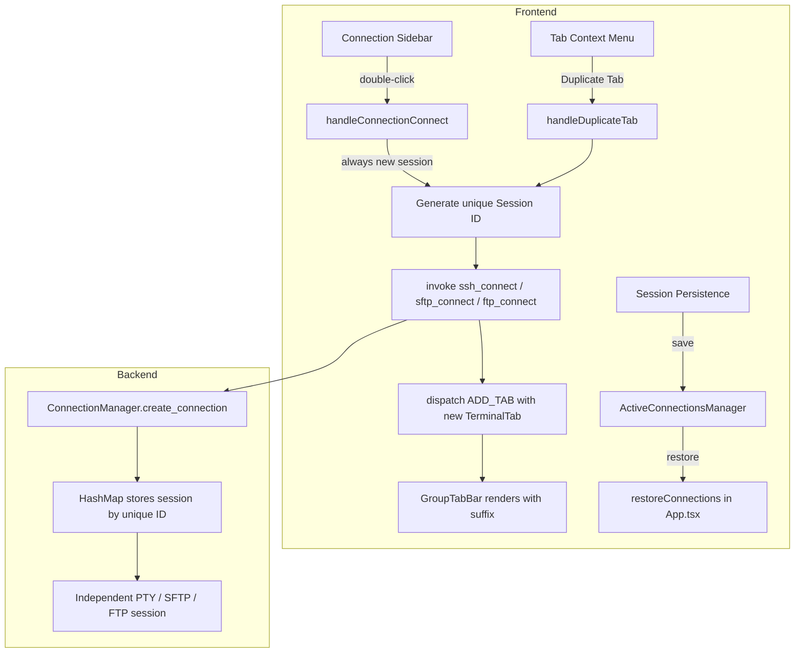

# Design Document: Multi-Connection Same Info

## Overview

This feature removes the restriction that prevents users from opening multiple independent sessions to the same server from a single saved connection profile. Currently, when a user double-clicks a connection in the sidebar that already has an open tab in the active terminal group, the app activates the existing tab instead of creating a new session. After this change, every activation of a connection profile will open a new independent tab with its own backend connection, PTY session, and lifecycle.

The feature spans the full stack:
- **Frontend**: Modify sidebar connection handling in `App.tsx`, add duplicate-suffix tab naming in `GroupTabBar`, extend session persistence in `ActiveConnectionsManager`, and add "Duplicate Tab" support for SFTP/FTP protocols.
- **Backend**: No structural changes needed — `ConnectionManager` already supports arbitrary session IDs in its `HashMap<String, Arc<RwLock<SshClient>>>`. Each duplicate session simply uses a unique key like `{profileId}-dup-{timestamp}`.

### Key Design Decision: Always Open New Tab

The current behavior in `handleConnectionConnect` checks whether a tab with the same connection ID exists in the active group and activates it if found. The new behavior removes this guard entirely — every sidebar activation creates a new session with a unique ID. This is the simplest approach and matches how terminal emulators like iTerm2 and Windows Terminal handle duplicate connections.

## Architecture



### Session ID Strategy

| Scenario | Session ID Format | `originalConnectionId` |
|----------|-------------------|------------------------|
| First tab from profile | `{profileId}` | `undefined` |
| Subsequent tabs from same profile | `{profileId}-dup-{timestamp}` | `{profileId}` |
| Duplicate via context menu | `{profileId}-dup-{timestamp}` | `{profileId}` |

This pattern already exists in the codebase for cross-group duplicates. The change extends it to same-group sidebar activations.

## Components and Interfaces

### 1. `App.tsx` — `handleConnectionConnect` (Modified)

Current behavior: checks `existingTabInActiveGroup` and activates it if found.

New behavior: always generate a new session ID and open a new tab. The `existsElsewhere` check is replaced by an `existsAnywhere` check that includes the active group.

```typescript
// Before (simplified):
const existingTabInActiveGroup = currentGroup?.tabs.find(
  tab => tab.id === connection.id || tab.originalConnectionId === connection.id
);
if (existingTabInActiveGroup) {
  dispatch({ type: 'ACTIVATE_TAB', ... });
  return;
}

// After (simplified):
const existsAnywhere = allTabs.some(
  tab => tab.id === connection.id || tab.originalConnectionId === connection.id
);
const sessionId = existsAnywhere
  ? `${connection.id}-dup-${Date.now()}`
  : connection.id;
// Always proceed to create new connection + tab
```

### 2. `App.tsx` — `handleDuplicateTab` (Extended)

Currently only supports SSH duplication. Extended to support SFTP and FTP protocols by checking `tabToDuplicate.tabType` and invoking the appropriate backend command (`sftp_connect` or `ftp_connect`).

### 3. `GroupTabBar` — Tab Display Name (Modified)

Add a suffix computation function that counts tabs sharing the same `originalConnectionId` (or base connection ID) within a group:

```typescript
function getTabDisplayName(tab: TerminalTab, allTabsInGroup: TerminalTab[]): string {
  const baseId = tab.originalConnectionId || tab.id;
  const siblings = allTabsInGroup.filter(t => 
    t.id === baseId || t.originalConnectionId === baseId
  );
  if (siblings.length <= 1) return tab.name;
  const index = siblings.indexOf(tab) + 1;
  return `${tab.name} (${index})`;
}
```

### 4. `ActiveConnectionsManager` — Session Persistence (No Change Needed)

The `ActiveConnectionState` interface already has `originalConnectionId` and `protocol` fields. The restoration logic in `App.tsx` already handles duplicate tabs by looking up credentials via `originalConnectionId`. No structural changes needed.

### 5. `ConnectionManager` (Rust) — No Changes

The backend `ConnectionManager` is keyed by `connection_id: String` in all its HashMaps. It has no concept of "one session per profile" — that restriction exists only in the frontend's `handleConnectionConnect`. Each call to `create_connection`, `create_sftp_connection`, or `create_ftp_connection` with a unique ID creates an independent session.

## Data Models

### TerminalTab (Existing — No Changes)

```typescript
interface TerminalTab {
  id: string;                    // Unique session ID (e.g., "conn-123" or "conn-123-dup-1719000000")
  name: string;                  // Display name from connection profile
  tabType?: 'terminal' | 'file-browser' | 'desktop' | 'editor';
  protocol?: string;
  host?: string;
  username?: string;
  originalConnectionId?: string; // Points to the saved connection profile ID
  connectionStatus: 'connected' | 'connecting' | 'disconnected' | 'pending';
  reconnectCount: number;
}
```

### ActiveConnectionState (Existing — No Changes)

```typescript
interface ActiveConnectionState {
  tabId: string;
  connectionId: string;
  order: number;
  originalConnectionId?: string; // For duplicated tabs
  tabType?: 'terminal' | 'file-browser' | 'desktop' | 'editor';
  protocol?: string;
}
```

### ConnectionData (Existing — No Changes)

The saved connection profile in localStorage. Credentials are read from here during duplication and restoration. No schema changes needed.


## Correctness Properties

*A property is a characteristic or behavior that should hold true across all valid executions of a system — essentially, a formal statement about what the system should do. Properties serve as the bridge between human-readable specifications and machine-verifiable correctness guarantees.*

### Property 1: Activating a profile always adds a new tab

*For any* terminal group state containing one or more tabs from a given connection profile, and for any protocol (SSH, SFTP, FTP), activating that profile should result in the state having exactly one more tab than before, and the new tab should be in the active group.

**Validates: Requirements 1.1, 6.1, 6.2**

### Property 2: Session ID uniqueness

*For any* set of existing session IDs and any sequence of new session creations from the same connection profile, all generated session IDs should be distinct from each other and from all existing IDs.

**Validates: Requirements 1.2, 6.3**

### Property 3: Duplicate tabs reference the original profile

*For any* tab created as a duplicate (whether via sidebar re-activation or context menu), the tab's `originalConnectionId` field should equal the connection profile ID, and the tab's `id` should differ from the profile ID.

**Validates: Requirements 1.3, 5.1**

### Property 4: Tab display name suffix correctness

*For any* terminal group containing N tabs (N ≥ 1) that share the same base connection profile, the display name function should: (a) return the profile name without suffix when N = 1, and (b) return the profile name with a unique numeric suffix for each tab when N > 1. All suffixes within a group should be distinct.

**Validates: Requirements 2.1, 2.2, 2.3**

### Property 5: Closing a tab preserves sibling tabs

*For any* terminal group state containing multiple tabs from the same connection profile, removing one tab via `REMOVE_TAB` should leave all other tabs from that profile unchanged (same IDs, same connection status, same originalConnectionId).

**Validates: Requirements 3.1**

### Property 6: Status update isolation

*For any* terminal group state containing multiple tabs from the same connection profile, dispatching `UPDATE_TAB_STATUS` for one tab should change only that tab's `connectionStatus` and leave all sibling tabs' statuses unchanged.

**Validates: Requirements 3.2, 3.3**

### Property 7: Persistence round-trip for duplicate tabs

*For any* terminal group state containing duplicate tabs (tabs with `originalConnectionId` set), serializing the state and then deserializing it should produce a state where every duplicate tab retains its unique `id`, `originalConnectionId`, `protocol`, and `tabType`.

**Validates: Requirements 4.1**

## Error Handling

| Scenario | Handling |
|----------|----------|
| Backend connection fails for duplicate session | Show `toast.error` with server error message. Tab is not added to the group. User can retry via sidebar. |
| No saved credentials for duplication | Show `toast.error("Cannot Duplicate Tab", "No saved credentials found")`. Duplication is blocked. |
| Session restoration fails for one duplicate tab | Mark that tab as `disconnected`. Continue restoring remaining tabs. Show summary toast at end. |
| WebSocket port unavailable during duplicate PTY start | PTY `StartPty` message fails. Terminal shows connection error overlay. User can click "Reconnect". |
| localStorage quota exceeded during persistence | `saveState` catches the error and logs a warning. State is lost on next restart but app continues working. |
| Duplicate session ID collision (extremely unlikely with timestamp) | The `saveConnectionWithId` method in `ConnectionStorageManager` uses upsert semantics — if the ID already exists, it updates rather than creating a duplicate entry. |

## Testing Strategy

### Unit Tests

- Test `getTabDisplayName` function with 0, 1, 2, and 5 tabs from the same profile
- Test that `handleDuplicateTab` for SFTP/FTP tabs invokes the correct backend command
- Test that closing a duplicate tab calls `ssh_disconnect` / `sftp_standalone_disconnect` / `ftp_disconnect` with the correct session ID
- Test session restoration with a mix of original and duplicate tabs
- Test edge case: duplicate tab when `originalConnectionId` chain is already set (duplicate of a duplicate)

### Property-Based Tests

Property-based tests use `fast-check` (already configured in the project). Each test runs a minimum of 100 iterations.

- **Feature: multi-connection-same-info, Property 1: Activating a profile always adds a new tab** — Generate random `TerminalGroupState` with existing tabs, simulate profile activation, verify tab count increases by 1.
- **Feature: multi-connection-same-info, Property 2: Session ID uniqueness** — Generate random sequences of session ID generations from the same profile ID, verify all IDs are unique.
- **Feature: multi-connection-same-info, Property 3: Duplicate tabs reference the original profile** — Generate random duplicate tab creation scenarios, verify `originalConnectionId` is set correctly.
- **Feature: multi-connection-same-info, Property 4: Tab display name suffix correctness** — Generate random groups with 1–10 tabs from the same profile, verify suffix uniqueness and format.
- **Feature: multi-connection-same-info, Property 5: Closing a tab preserves sibling tabs** — Generate random states with multiple same-profile tabs, remove one, verify siblings unchanged.
- **Feature: multi-connection-same-info, Property 6: Status update isolation** — Generate random states with multiple same-profile tabs, update one tab's status, verify siblings unchanged.
- **Feature: multi-connection-same-info, Property 7: Persistence round-trip for duplicate tabs** — Generate random states with duplicate tabs, serialize then deserialize, verify equality.
