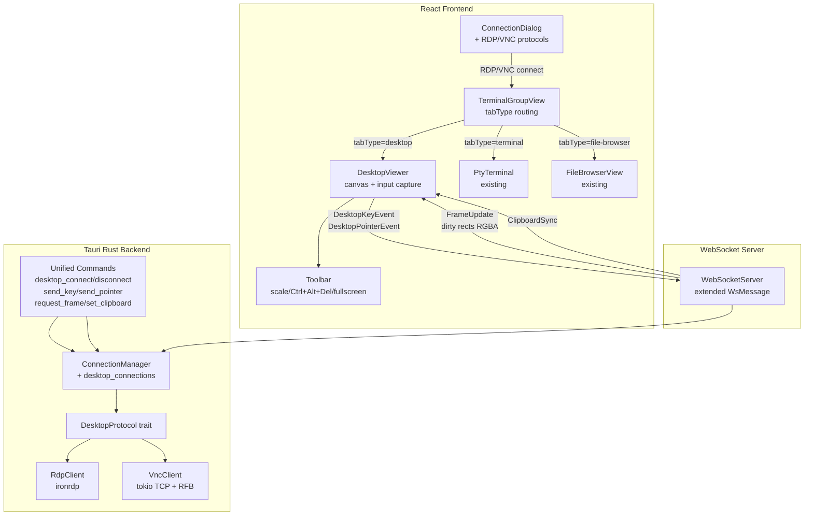
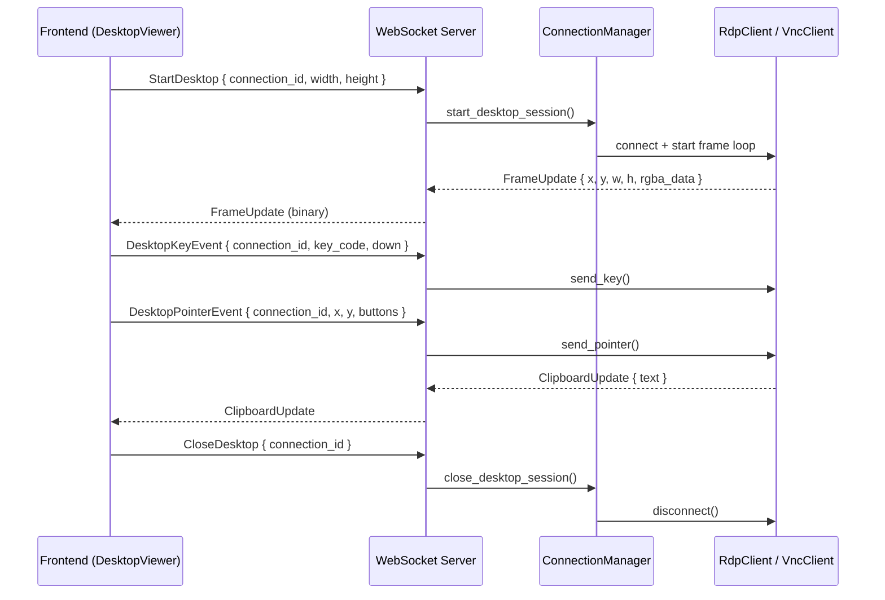

# Design Document: RDP/VNC Remote Desktop Support

## Overview

This design adds RDP (Remote Desktop Protocol) and VNC (Virtual Network Computing) support to R-Shell, enabling users to view and interact with remote graphical desktops directly within the existing tab and split-view layout. RDP targets Windows hosts; VNC provides cross-platform remote desktop access via the RFB protocol.

The key architectural changes are:

1. **Connection Dialog** — extend `ConnectionConfig` and the dialog UI to support RDP/VNC protocol selection with protocol-specific form fields (domain, resolution for RDP; color depth for VNC).
2. **Connection Storage** — extend `ConnectionData` to persist RDP/VNC-specific fields (domain, resolution preference, color depth, VNC-only password).
3. **Backend Clients** — add `RdpClient` and `VncClient` Rust modules implementing a shared `DesktopProtocol` trait for unified remote desktop operations (connect, disconnect, send key/pointer, request frame, clipboard).
4. **Connection Manager** — extend to store RDP/VNC sessions in a new `desktop_connections` HashMap, with protocol dispatch via `get_connection_type`.
5. **WebSocket Extension** — extend the existing `WsMessage` enum with desktop-specific variants for frame streaming (dirty rectangles as binary RGBA), keyboard/mouse input forwarding, and clipboard sync.
6. **Desktop Viewer Component** — a new canvas-based React component that renders framebuffer updates, captures keyboard/mouse input, supports Fit-to-Window and 1:1 scaling modes, and provides a toolbar overlay.
7. **Tab Integration** — extend `TerminalTab` with a `'desktop'` tab type so the grid renderer can show a `DesktopViewer` instead of `PtyTerminal` or `FileBrowserView`.

### Design Decisions

- **Unified `DesktopProtocol` trait**: The frontend calls protocol-agnostic Tauri commands (`desktop_connect`, `desktop_disconnect`, `desktop_send_key`, etc.). The backend determines the protocol from the stored connection and delegates to `RdpClient` or `VncClient`. This mirrors the `FileProtocol` pattern used for SFTP/FTP.
- **Tab type `'desktop'` over reusing `'file-browser'`**: Remote desktop sessions have fundamentally different rendering (canvas + input capture) compared to file browsers or terminals. A distinct tab type keeps the routing logic clean.
- **WebSocket for frame streaming**: Frame data is high-bandwidth and latency-sensitive. The existing WebSocket infrastructure (ports 9001-9010) already handles PTY streaming. We extend `WsMessage` with desktop-specific variants rather than creating a separate WebSocket server.
- **Dirty rectangle updates**: Both RDP and VNC natively produce rectangular framebuffer updates. The backend decodes these into RGBA pixel data and sends only changed regions over WebSocket, minimizing bandwidth.
- **`ironrdp` crate for RDP**: The `ironrdp` crate is the most mature pure-Rust RDP implementation, supporting NLA authentication, TLS, framebuffer decoding, and input forwarding. It integrates well with tokio.
- **Custom VNC via `tokio` TCP**: The RFB protocol is simple enough (handshake → auth → framebuffer updates) that we implement a lightweight VNC client using raw TCP with `tokio`, supporting Raw, CopyRect, and Zlib encodings. This avoids pulling in heavy C dependencies.
- **Canvas rendering with `putImageData`**: The `DesktopViewer` uses an HTML Canvas 2D context with `putImageData` for dirty rectangle updates. This avoids WebGL complexity while providing adequate performance for typical remote desktop frame rates.
- **Layout adaptation**: When a desktop tab is active, the right sidebar (System Monitor/Logs) and bottom panel (IntegratedFileBrowser) are hidden since there's no SSH shell to query — same pattern as SFTP/FTP tabs.

## Architecture



### WebSocket Message Flow



## Components and Interfaces

### Frontend Components

#### 1. ConnectionDialog Changes (`connection-dialog.tsx`)

Extend `ConnectionConfig`:

```typescript
export interface ConnectionConfig {
  // ... existing fields ...
  protocol: 'SSH' | 'Telnet' | 'Raw' | 'Serial' | 'SFTP' | 'FTP' | 'RDP' | 'VNC';
  // RDP-specific
  domain?: string;
  rdpResolution?: '1024x768' | '1280x720' | '1920x1080' | 'fit';
  // VNC-specific
  vncColorDepth?: '24' | '16' | '8';
}
```

The dialog conditionally renders form sections based on protocol:
- RDP: show host, port (default 3389), username, password, domain (optional), resolution dropdown. Hide SSH-specific options.
- VNC: show host, port (default 5900), password. Hide username, SSH-specific options. Hide auth method selector (VNC uses password-only or no-auth).

#### 2. TerminalTab Extension (`terminal-group-types.ts`)

```typescript
export interface TerminalTab {
  id: string;
  name: string;
  tabType?: 'terminal' | 'file-browser' | 'desktop'; // add 'desktop'
  protocol?: string;
  host?: string;
  username?: string;
  originalConnectionId?: string;
  connectionStatus: 'connected' | 'connecting' | 'disconnected' | 'pending';
  reconnectCount: number;
}
```

#### 3. TerminalGroupView Routing

The view checks `tab.tabType` to decide what to render:

```typescript
{tab.tabType === 'desktop' ? (
  <DesktopViewer
    connectionId={tab.id}
    connectionName={tab.name}
    host={tab.host}
    protocol={tab.protocol}
    isConnected={tab.connectionStatus === 'connected'}
  />
) : tab.tabType === 'file-browser' ? (
  <FileBrowserView ... />
) : (
  <PtyTerminal ... />
)}
```

#### 4. DesktopViewer (`components/desktop-viewer.tsx`) — New

Primary view for RDP/VNC tabs. Contains:
- An HTML `<canvas>` element sized to the remote desktop resolution (or scaled)
- `onKeyDown`/`onKeyUp` handlers that capture keyboard events and send them via WebSocket as `DesktopKeyEvent`
- `onMouseMove`/`onMouseDown`/`onMouseUp`/`onWheel` handlers that capture mouse events and send them via WebSocket as `DesktopPointerEvent`
- Coordinate translation from browser canvas coordinates to remote desktop coordinates (accounting for scaling factor)
- Two scaling modes toggled via toolbar:
  - **Fit to Window**: scales canvas via CSS `object-fit: contain` to fill the tab area while preserving aspect ratio
  - **1:1**: renders at native resolution with overflow scrollbars
- A loading indicator shown while the initial full framebuffer is being received
- `onBlur` handler that sends key-up events for all currently pressed keys to prevent stuck keys on the remote host
- `tabIndex={0}` and focus management to ensure keyboard capture works

Framebuffer rendering approach:
- Maintain an `ImageData` buffer matching the remote desktop resolution
- On each `FrameUpdate` message, use `putImageData` with the dirty rectangle coordinates to update only the changed region
- For "full frame request", the backend sends the entire framebuffer as one large rectangle

#### 5. DesktopToolbar (`components/desktop-toolbar.tsx`) — New

Floating toolbar overlay at the top of the `DesktopViewer`:
- Toggle scaling mode button (Fit to Window ↔ 1:1)
- Send Ctrl+Alt+Del button (RDP only — hidden for VNC)
- Toggle full-screen button
- Disconnect button
- Auto-hides after 3 seconds of mouse inactivity, reappears on mouse movement near the top edge

#### 6. Layout Adaptation (`App.tsx`)

Same pattern as SFTP/FTP tabs:

```typescript
const isDesktopTab = activeTab?.tabType === 'desktop';
const isFileBrowserTab = activeTab?.tabType === 'file-browser';
const hideSecondaryPanels = isDesktopTab || isFileBrowserTab;

// Right sidebar and bottom panel hidden when desktop or file-browser tab is active
```

### Backend Components

#### 7. DesktopProtocol Trait (`src-tauri/src/desktop_protocol.rs`) — New

```rust
#[async_trait]
pub trait DesktopProtocol: Send + Sync {
    /// Start the frame update loop, sending FrameUpdate messages via the provided sender
    async fn start_frame_loop(
        &self,
        frame_tx: mpsc::UnboundedSender<FrameUpdate>,
        cancel: CancellationToken,
    ) -> Result<()>;

    /// Send a keyboard event to the remote host
    async fn send_key(&self, key_code: u32, down: bool) -> Result<()>;

    /// Send a pointer (mouse) event to the remote host
    async fn send_pointer(&self, x: u16, y: u16, button_mask: u8) -> Result<()>;

    /// Request a full framebuffer update
    async fn request_full_frame(&self) -> Result<()>;

    /// Send clipboard text to the remote session
    async fn set_clipboard(&self, text: String) -> Result<()>;

    /// Get the remote desktop dimensions
    fn desktop_size(&self) -> (u16, u16);

    /// Disconnect and release resources
    async fn disconnect(&mut self) -> Result<()>;
}

#[derive(Clone)]
pub struct FrameUpdate {
    pub x: u16,
    pub y: u16,
    pub width: u16,
    pub height: u16,
    pub rgba_data: Vec<u8>,
}
```

#### 8. RdpClient (`src-tauri/src/rdp_client.rs`) — New

Implements `DesktopProtocol`. Uses the `ironrdp` crate for RDP protocol handling.

```rust
pub struct RdpClient {
    // ironrdp session handle
    session: Option<ironrdp::session::ActiveSession>,
    desktop_width: u16,
    desktop_height: u16,
}

impl RdpClient {
    pub async fn connect(config: &RdpConfig) -> Result<Self> {
        // 1. TCP connect to host:port
        // 2. TLS upgrade
        // 3. NLA authentication (username, password, domain)
        // 4. Negotiate display resolution
        // 5. Start graphics pipeline
        ...
    }
}

impl DesktopProtocol for RdpClient { ... }
```

Key behaviors:
- NLA authentication with username/password/domain
- TLS encryption for the connection
- Framebuffer decoding produces RGBA pixel data
- Keyboard events forwarded as RDP scancode input events
- Mouse events forwarded as RDP pointer input events
- Supports display resize negotiation via `Display Update Virtual Channel`
- Clipboard sync via RDP clipboard virtual channel (`CLIPRDR`)

#### 9. VncClient (`src-tauri/src/vnc_client.rs`) — New

Implements `DesktopProtocol`. Uses raw TCP with `tokio` implementing the RFB protocol.

```rust
pub struct VncClient {
    stream: Option<tokio::net::TcpStream>,
    desktop_width: u16,
    desktop_height: u16,
    pixel_format: PixelFormat,
}

impl VncClient {
    pub async fn connect(config: &VncConfig) -> Result<Self> {
        // 1. TCP connect to host:port
        // 2. RFB version handshake
        // 3. Security type negotiation (VNC auth or no-auth)
        // 4. VNC auth: DES challenge-response with password
        // 5. ClientInit (shared flag)
        // 6. ServerInit (desktop size, pixel format, name)
        // 7. SetPixelFormat based on requested color depth
        // 8. SetEncodings (Raw, CopyRect, Zlib)
        ...
    }
}

impl DesktopProtocol for VncClient { ... }
```

Key behaviors:
- RFB protocol handshake (version 3.8)
- VNC authentication (DES challenge-response) and no-auth modes
- Framebuffer encodings: Raw, CopyRect, Zlib (minimum set per requirements)
- Color depth negotiation via `SetPixelFormat` message
- Incremental framebuffer update requests to minimize bandwidth
- Keyboard events forwarded as RFB `KeyEvent` messages
- Mouse events forwarded as RFB `PointerEvent` messages
- Clipboard sync via `ServerCutText` / `ClientCutText` messages

#### 10. ConnectionManager Extension (`connection_manager.rs`)

Add a new HashMap for desktop protocol sessions:

```rust
pub struct ConnectionManager {
    connections: Arc<RwLock<HashMap<String, Arc<RwLock<SshClient>>>>>,
    sftp_connections: Arc<RwLock<HashMap<String, StandaloneSftpClient>>>,
    ftp_connections: Arc<RwLock<HashMap<String, FtpClient>>>,
    desktop_connections: Arc<RwLock<HashMap<String, Arc<RwLock<Box<dyn DesktopProtocol>>>>>>,  // NEW
    connection_types: Arc<RwLock<HashMap<String, String>>>,  // tracks protocol per connection ID
    pty_sessions: ...,
    pty_generations: ...,
    pending_connections: ...,
}
```

New methods:
- `create_desktop_connection(id, protocol, config)` — creates RDP or VNC session, stores in `desktop_connections`
- `get_desktop_connection(id)` — returns the `DesktopProtocol` trait object
- `close_desktop_connection(id)` — disconnects and removes
- `start_desktop_stream(id, frame_tx, cancel)` — starts the frame update loop for a session

#### 11. WebSocket Extension (`websocket_server.rs`)

Extend `WsMessage` with desktop-specific variants:

```rust
pub enum WsMessage {
    // ... existing PTY variants ...

    /// Start a desktop streaming session
    StartDesktop {
        connection_id: String,
        width: u16,
        height: u16,
    },
    /// Desktop framebuffer update (dirty rectangle)
    /// NOTE: FrameUpdate is serialized as binary WebSocket messages (not JSON)
    /// because large RGBA payloads are inefficient in JSON. The binary format is:
    /// 1 byte tag (0x10) + connection_id length (u32 BE) + connection_id bytes
    /// + x (u16 BE) + y (u16 BE) + width (u16 BE) + height (u16 BE) + RGBA data.
    /// This variant is kept here for type coverage but actual wire format is binary.
    FrameUpdate {
        connection_id: String,
        x: u16,
        y: u16,
        width: u16,
        height: u16,
        rgba_data: Vec<u8>,
    },
    /// Desktop keyboard event from frontend
    DesktopKeyEvent {
        connection_id: String,
        key_code: u32,
        down: bool,
    },
    /// Desktop pointer event from frontend
    DesktopPointerEvent {
        connection_id: String,
        x: u16,
        y: u16,
        button_mask: u8,
    },
    /// Clipboard update (bidirectional)
    ClipboardUpdate {
        connection_id: String,
        text: String,
    },
    /// Request full framebuffer
    RequestFullFrame {
        connection_id: String,
    },
    /// Close desktop session
    CloseDesktop {
        connection_id: String,
    },
    /// Desktop session started confirmation
    DesktopStarted {
        connection_id: String,
        width: u16,
        height: u16,
    },
}
```

The `FrameUpdate` variant uses binary WebSocket messages for efficiency. The message format is:
- 1 byte: message type tag (e.g., `0x10` for FrameUpdate)
- 8 bytes: connection_id length (u32) + connection_id bytes
- 2 bytes: x offset (u16 big-endian)
- 2 bytes: y offset (u16 big-endian)
- 2 bytes: width (u16 big-endian)
- 2 bytes: height (u16 big-endian)
- remaining: RGBA pixel data (width × height × 4 bytes)

#### 12. Unified Tauri Commands (`commands.rs`)

New commands that delegate to the appropriate protocol client:

```rust
#[tauri::command]
pub async fn desktop_connect(
    connection_id: String,
    request: DesktopConnectRequest,
    state: State<'_, Arc<ConnectionManager>>,
) -> Result<DesktopConnectResponse, String>

#[tauri::command]
pub async fn desktop_disconnect(
    connection_id: String,
    state: State<'_, Arc<ConnectionManager>>,
) -> Result<(), String>

#[tauri::command]
pub async fn desktop_send_key(
    connection_id: String,
    key_code: u32,
    down: bool,
    state: State<'_, Arc<ConnectionManager>>,
) -> Result<(), String>

#[tauri::command]
pub async fn desktop_send_pointer(
    connection_id: String,
    x: u16,
    y: u16,
    button_mask: u8,
    state: State<'_, Arc<ConnectionManager>>,
) -> Result<(), String>

#[tauri::command]
pub async fn desktop_request_frame(
    connection_id: String,
    state: State<'_, Arc<ConnectionManager>>,
) -> Result<(), String>

#[tauri::command]
pub async fn desktop_set_clipboard(
    connection_id: String,
    text: String,
    state: State<'_, Arc<ConnectionManager>>,
) -> Result<(), String>
```

## Data Models

### Frontend Data Models

#### ConnectionConfig (Extended)

```typescript
export interface ConnectionConfig {
  id?: string;
  name: string;
  protocol: 'SSH' | 'Telnet' | 'Raw' | 'Serial' | 'SFTP' | 'FTP' | 'RDP' | 'VNC';
  host: string;
  port: number;
  username: string;
  authMethod: 'password' | 'publickey' | 'keyboard-interactive' | 'anonymous';
  password?: string;
  privateKeyPath?: string;
  passphrase?: string;
  // RDP-specific
  domain?: string;
  rdpResolution?: '1024x768' | '1280x720' | '1920x1080' | 'fit';
  // VNC-specific
  vncColorDepth?: '24' | '16' | '8';
  // FTP-specific
  ftpsEnabled?: boolean;
  // SSH-specific (hidden for SFTP/FTP/RDP/VNC)
  compression?: boolean;
  keepAlive?: boolean;
  keepAliveInterval?: number;
  serverAliveCountMax?: number;
  // Proxy
  proxyType?: 'none' | 'http' | 'socks4' | 'socks5';
  proxyHost?: string;
  proxyPort?: number;
  proxyUsername?: string;
  proxyPassword?: string;
}
```

#### ConnectionData (Extended)

```typescript
export interface ConnectionData {
  // ... all existing fields ...
  protocol: string; // now includes 'RDP' | 'VNC'
  // RDP-specific
  domain?: string;
  rdpResolution?: string;
  // VNC-specific
  vncColorDepth?: string;
  vncPassword?: string; // separate from password field, VNC has no username
}
```

#### DesktopViewerState

```typescript
export interface DesktopViewerState {
  connectionId: string;
  protocol: 'RDP' | 'VNC';
  desktopWidth: number;
  desktopHeight: number;
  scalingMode: 'fit' | 'native';
  isFullScreen: boolean;
  isLoading: boolean;
  pressedKeys: Set<number>; // track pressed keys for blur release
}
```

### Backend Data Models

#### DesktopConnectRequest

```rust
#[derive(Deserialize)]
pub struct DesktopConnectRequest {
    pub protocol: String,        // "RDP" or "VNC"
    pub host: String,
    pub port: u16,
    pub username: Option<String>, // RDP only
    pub password: Option<String>,
    pub domain: Option<String>,   // RDP only
    pub resolution: Option<String>, // RDP: "1024x768", "1280x720", "1920x1080", "fit"
    pub color_depth: Option<u8>,  // VNC: 24, 16, 8
}
```

#### DesktopConnectResponse

```rust
#[derive(Serialize)]
pub struct DesktopConnectResponse {
    pub width: u16,
    pub height: u16,
    pub protocol: String,
}
```

#### RdpConfig / VncConfig

```rust
pub struct RdpConfig {
    pub host: String,
    pub port: u16,
    pub username: String,
    pub password: String,
    pub domain: Option<String>,
    pub width: u16,
    pub height: u16,
}

pub struct VncConfig {
    pub host: String,
    pub port: u16,
    pub password: Option<String>,
    pub color_depth: u8, // 24, 16, or 8
}
```

#### FrameUpdate (shared between backend and WebSocket)

```rust
#[derive(Clone, Serialize)]
pub struct FrameUpdate {
    pub x: u16,
    pub y: u16,
    pub width: u16,
    pub height: u16,
    pub rgba_data: Vec<u8>, // width * height * 4 bytes
}
```


## Correctness Properties

*A property is a characteristic or behavior that should hold true across all valid executions of a system — essentially, a formal statement about what the system should do. Properties serve as the bridge between human-readable specifications and machine-verifiable correctness guarantees.*

### Property 1: Protocol default port mapping

*For any* supported protocol (SSH, Telnet, Raw, Serial, SFTP, FTP, RDP, VNC), the default port returned by the protocol-to-port mapping function should match the protocol's standard port (SSH=22, SFTP=22, FTP=21, Telnet=23, Raw=0, Serial=0, RDP=3389, VNC=5900).

**Validates: Requirements 1.2, 1.3**

### Property 2: Protocol field visibility

*For any* protocol, the set of visible form fields returned by the field visibility function should be correct: RDP shows host, port, username, password, domain, and resolution dropdown; VNC shows host, port, password, and color depth dropdown; both RDP and VNC hide SSH-specific options (compression, keepAliveInterval, serverAliveCountMax, publickey auth). No protocol should display fields that don't belong to it.

**Validates: Requirements 1.4, 1.5, 1.6, 1.7, 1.8**

### Property 3: Connection storage round trip

*For any* valid `ConnectionData` object with protocol "RDP" or "VNC" (including RDP-specific fields: domain, rdpResolution; and VNC-specific fields: vncColorDepth, vncPassword), saving it to `ConnectionStorageManager` and then loading it back by ID should produce an equivalent object with all fields preserved.

**Validates: Requirements 2.1, 2.2, 2.3, 2.4, 2.7**

### Property 4: Protocol-agnostic storage queries

*For any* set of saved connections with mixed protocols (SSH, SFTP, FTP, RDP, VNC), querying favorites, recent connections, folder contents, and search results should return connections regardless of their protocol. The count of connections matching a query should not change if we swap the protocol of a connection that otherwise matches the query criteria.

**Validates: Requirements 2.5**

### Property 5: Connection export/import round trip

*For any* set of connections (including RDP and VNC profiles with their protocol-specific fields) and folders, exporting to JSON and then importing should preserve all connections with all fields intact.

**Validates: Requirements 2.6**

### Property 6: Desktop connection manager storage

*For any* desktop connection (RDP or VNC), after creating the connection via the connection manager, the connection should be retrievable by its ID, and the stored connection type should match the protocol used to create it.

**Validates: Requirements 3.3, 4.3**

### Property 7: VNC framebuffer decode output size

*For any* valid Raw-encoded VNC framebuffer rectangle with dimensions (width, height), decoding it should produce exactly `width × height × 4` bytes of RGBA pixel data.

**Validates: Requirements 4.7**

### Property 8: Frame update dirty rectangle bounds

*For any* `FrameUpdate` message with desktop dimensions (desktop_width, desktop_height), the dirty rectangle must satisfy: `x + width <= desktop_width` and `y + height <= desktop_height`, and `width > 0` and `height > 0`, and `rgba_data.len() == width * height * 4`.

**Validates: Requirements 5.2**

### Property 9: Frame update binary serialization round trip

*For any* valid `FrameUpdate` (with arbitrary connection_id, x, y, width, height, and RGBA data), serializing it to the binary WebSocket format and deserializing it back should produce an identical `FrameUpdate` with all fields preserved.

**Validates: Requirements 5.3**

### Property 10: Coordinate translation

*For any* browser mouse coordinate (bx, by), desktop size (dw, dh), and container size (cw, ch), the translated remote desktop coordinate should equal `(bx * dw / displayed_w, by * dh / displayed_h)` where `displayed_w` and `displayed_h` are the scaled dimensions. The translated coordinates should always be within `[0, dw)` and `[0, dh)`.

**Validates: Requirements 6.5**

### Property 11: Fit-to-window scaling preserves aspect ratio

*For any* remote desktop size (dw, dh) and container size (cw, ch) where all dimensions are positive, the computed scale factor should be `min(cw/dw, ch/dh)`, the resulting displayed size `(dw * scale, dh * scale)` should fit within the container (`<= cw` and `<= ch`), and the aspect ratio should be preserved (`displayed_w / displayed_h ≈ dw / dh`).

**Validates: Requirements 6.6, 9.1, 9.3, 9.4**

### Property 12: Key release on blur

*For any* set of currently pressed key codes (non-empty), when the `DesktopViewer` loses focus, it should emit a key-up event for each pressed key and the resulting pressed keys set should be empty.

**Validates: Requirements 6.11**

### Property 13: Tab icon by tab type

*For any* tab in the tab bar, tabs with `tabType === 'desktop'` should render a desktop/monitor icon, tabs with `tabType === 'file-browser'` should render a file icon, and tabs with `tabType === 'terminal'` should render a terminal icon. The icon selection should be deterministic based solely on `tabType`.

**Validates: Requirements 7.1**

### Property 14: Active desktop tab persistence round trip

*For any* set of active connections including RDP/VNC tabs, saving via `ActiveConnectionsManager` and loading back should preserve all tab entries with their connection IDs, protocols, and order.

**Validates: Requirements 7.3**

### Property 15: Disconnected tab indicator

*For any* tab with `connectionStatus === 'disconnected'`, the tab should render a disconnected visual indicator and a reconnect action should be available, regardless of the tab's protocol.

**Validates: Requirements 7.5**

### Property 16: Clipboard text round trip

*For any* plain text string, encoding it for clipboard transmission (via RDP CLIPRDR format or VNC ClientCutText format) and decoding it back should produce the original string.

**Validates: Requirements 8.3**

### Property 17: Protocol dispatch correctness

*For any* stored desktop connection with a known protocol (RDP or VNC), the command dispatch logic should select the correct client implementation. RDP connections should delegate to `RdpClient`, VNC connections should delegate to `VncClient`. No cross-protocol dispatch should occur.

**Validates: Requirements 10.7**

## Error Handling

### Connection Errors

| Error Scenario | Handling |
|---|---|
| RDP auth failure (wrong credentials, NLA failure) | `RdpClient::connect` returns `Err` with descriptive message (e.g., "NLA authentication failed: invalid credentials"). Frontend shows `toast.error()`. Tab status set to `'disconnected'`. |
| VNC auth failure (wrong password) | `VncClient::connect` returns `Err` with message. Same frontend handling. |
| Host unreachable / connection refused | Both clients use tokio timeout (10s default). Returns `Err("Connection refused: {host}:{port}")` or `Err("Connection timed out")`. |
| TLS handshake failure (RDP) | `RdpClient::connect` returns `Err` indicating TLS failure. Toast with specific error. |
| Connection interrupted mid-session | Detected by the frame loop (read returns error). `DesktopProtocol` sends a disconnect notification via the frame channel. Tab status updated to `'disconnected'` with reconnect option. Frontend notified within 5 seconds per requirements. |
| WebSocket disconnection during streaming | Frame channel buffers up to 5 seconds of updates. On reconnection, buffered frames are replayed. If reconnection fails within 5 seconds, frames are dropped and a full frame request is issued on reconnect. |

### Input Errors

| Error Scenario | Handling |
|---|---|
| Key event forwarding fails | Logged via `tracing::warn`. No toast — transient errors are expected during network hiccups. |
| Mouse event forwarding fails | Same as key events — logged, not toasted. |
| Clipboard access denied by OS | `toast.info("Clipboard synchronization unavailable — access denied by the operating system")`. Clipboard bridge disabled for the session. |
| Clipboard text too large | Truncate to 1MB. Log warning. |

### Display Errors

| Error Scenario | Handling |
|---|---|
| RDP resize rejected by server | `RdpClient` retains current resolution. `DesktopViewer` falls back to scaling the existing framebuffer. No error toast — this is expected behavior. |
| Canvas rendering failure | Caught in try/catch around `putImageData`. Logged. Request full frame to recover. |
| Full-screen API denied | `toast.info("Full-screen mode unavailable")`. Button remains but is non-functional. |

### Frontend Error Handling

- All Tauri `invoke()` calls wrapped in try/catch
- Errors displayed via `toast.error()` from `sonner`
- Connection status tracked in `TerminalTab.connectionStatus`
- WebSocket errors trigger reconnection logic with exponential backoff

### Backend Error Handling

- All Tauri commands return `Result<T, String>`
- Internal operations use `anyhow::Result<T>`
- `DesktopProtocol` trait methods return `anyhow::Result<T>` — command layer converts to `String`
- Frame loop errors are sent as `WsMessage::Error` to the frontend

## Testing Strategy

### Property-Based Testing

Property-based tests use `fast-check` (already a project dependency) with a minimum of 100 iterations per property. Each test is tagged with a comment referencing the design property.

Tag format: `// Feature: rdp-vnc-remote-desktop, Property {N}: {title}`

Properties to implement as property-based tests:

| Property | Test Location | Generator Strategy |
|---|---|---|
| P1: Protocol default port | `src/lib/__tests__/protocol-config.test.ts` | Generate random protocol from the extended enum |
| P2: Protocol field visibility | `src/lib/__tests__/protocol-config.test.ts` | Generate random protocol, check visible fields set |
| P3: Connection storage round trip | `src/lib/__tests__/connection-storage.test.ts` | Generate random ConnectionData with RDP/VNC variants and protocol-specific fields |
| P4: Protocol-agnostic queries | `src/lib/__tests__/connection-storage.test.ts` | Generate mixed-protocol connection sets, verify query results include all protocols |
| P5: Export/import round trip | `src/lib/__tests__/connection-storage.test.ts` | Generate random connection sets with RDP/VNC profiles |
| P6: Desktop connection manager storage | Rust: `src-tauri/src/connection_manager.rs` tests | Create mock desktop connections, verify storage and retrieval |
| P7: VNC framebuffer decode output size | Rust: `src-tauri/src/vnc_client.rs` tests | Generate random (width, height) pairs and Raw-encoded pixel data |
| P8: Frame update dirty rect bounds | `src/lib/__tests__/desktop-viewer.test.ts` | Generate random FrameUpdate with desktop dimensions, validate bounds |
| P9: Frame update serialization round trip | Rust: `src-tauri/src/websocket_server.rs` tests | Generate random FrameUpdate structs, serialize/deserialize |
| P10: Coordinate translation | `src/lib/__tests__/desktop-viewer.test.ts` | Generate random browser coords, desktop size, container size |
| P11: Fit-to-window scaling | `src/lib/__tests__/desktop-viewer.test.ts` | Generate random desktop and container dimensions |
| P12: Key release on blur | `src/lib/__tests__/desktop-viewer.test.ts` | Generate random sets of pressed key codes |
| P13: Tab icon by type | `src/components/__tests__/tab-bar.test.ts` | Generate tabs with random tabType values |
| P14: Active tab persistence round trip | `src/lib/__tests__/connection-storage.test.ts` | Generate active connection sets with RDP/VNC entries |
| P15: Disconnected tab indicator | `src/components/__tests__/tab-bar.test.ts` | Generate tabs with connectionStatus 'disconnected' |
| P16: Clipboard text round trip | Rust: `src-tauri/src/desktop_protocol.rs` tests | Generate random UTF-8 strings |
| P17: Protocol dispatch | Rust: `src-tauri/src/connection_manager.rs` tests | Generate connection IDs with RDP/VNC protocols |

### Unit Tests

Unit tests complement property tests for specific examples and edge cases:

- **Connection Dialog**: Verify RDP selection shows domain field and resolution dropdown (example for 1.4, 1.6)
- **Connection Dialog**: Verify VNC selection hides username field and shows color depth dropdown (example for 1.5, 1.7)
- **DesktopViewer**: Verify 1:1 scaling mode uses scale factor 1.0 (example for 6.7)
- **DesktopViewer**: Verify Ctrl+Alt+Del button visible for RDP, hidden for VNC (example for 6.8)
- **DesktopViewer**: Verify loading indicator shown when `isLoading` is true (example for 6.10)
- **Tab bar**: Verify desktop tab shows desktop icon distinct from terminal icon (example for 7.1)
- **Error conditions**: Verify auth failure produces descriptive error message (edge case for 3.5, 4.5)
- **Error conditions**: Verify clipboard access denied shows toast (edge case for 8.6)
- **Edge case**: Verify coordinate translation clamps to desktop bounds for out-of-range mouse positions
- **Edge case**: Verify scaling with zero-dimension container doesn't produce NaN/Infinity

### Integration Tests

Backend integration tests (Rust `cargo test`) for:
- `RdpClient` connection lifecycle (requires test RDP server or mock)
- `VncClient` connection lifecycle (requires test VNC server or mock)
- `ConnectionManager` desktop connection storage and retrieval
- WebSocket message routing for desktop variants
- Unified command dispatch to correct protocol client

### Test Configuration

- Frontend: Vitest + jsdom, `fast-check` for property tests, minimum 100 iterations
- Backend: `cargo test` with `tokio::test` for async tests
- Each property test must reference its design property number in a comment
- Each correctness property is implemented by a single property-based test
