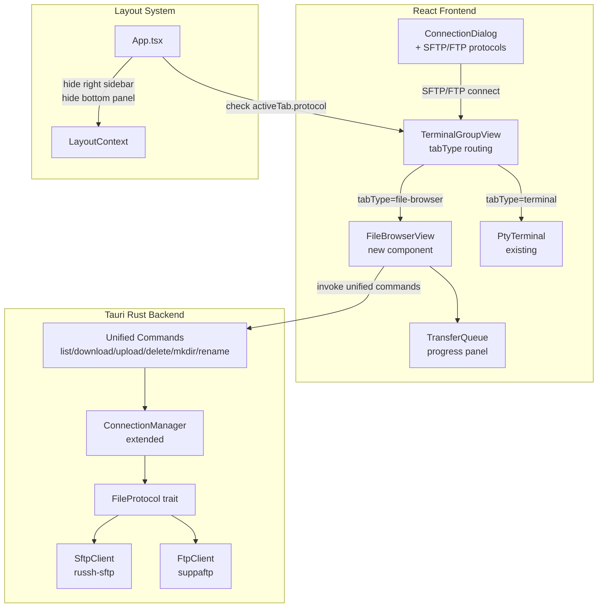
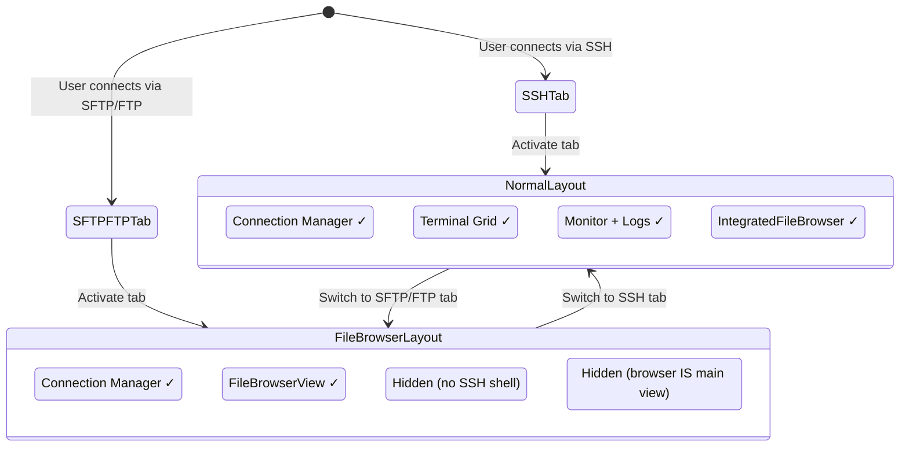

# Design Document: SFTP/FTP Connection Support

## Overview

This design adds standalone SFTP and FTP connection support to R-Shell. Currently, SFTP file operations are only available as a secondary panel over existing SSH terminal sessions. This feature introduces SFTP and FTP as first-class connection protocols: users can connect directly for file management without a terminal session.

The key architectural changes are:

1. **Connection Dialog** — extend `ConnectionConfig` and the dialog UI to support SFTP/FTP protocol selection with protocol-specific form fields.
2. **Connection Storage** — extend `ConnectionData` to persist FTP-specific fields (FTPS toggle, anonymous auth).
3. **Backend Clients** — add `SftpClient` (standalone SFTP over SSH without PTY) and `FtpClient` (FTP/FTPS) Rust modules, plus a `FileProtocol` trait for unified file operations.
4. **Connection Manager** — extend to store SFTP/FTP sessions alongside SSH sessions, with unified Tauri commands that delegate to the correct protocol client.
5. **Tab System** — extend `TerminalTab` with a `tabType` discriminator (`'terminal' | 'file-browser'`) so the grid renderer can show a file browser instead of a terminal.
6. **Layout Adaptation** — when the active tab is a file-browser tab, automatically hide the right sidebar (System Monitor/Logs) and bottom panel (IntegratedFileBrowser), since there is no SSH shell to query.
7. **File Browser Component** — a new dedicated `FileBrowserView` component rendered in the main content area for SFTP/FTP tabs, with directory listing, breadcrumb navigation, context menus, drag-and-drop upload, and an embedded transfer queue.

### Design Decisions

- **Unified file operation commands**: The frontend calls protocol-agnostic Tauri commands (`list_remote_files`, `download_remote_file`, etc.). The backend determines the protocol from the stored connection and delegates to the appropriate client. This keeps the frontend simple and protocol-unaware.
- **Tab type discriminator over separate tab system**: Rather than creating a parallel tab system for file-browser sessions, we add a `tabType` field to the existing `TerminalTab`. The `TerminalGroupView` checks this field to render either `PtyTerminal` or `FileBrowserView`. This reuses the entire existing tab management infrastructure (drag, split, reorder, close).
- **Layout auto-adaptation**: The right sidebar and bottom panel are conditionally hidden based on the active tab's type. This is handled in `App.tsx` by checking `activeConnection.protocol` — if it's SFTP or FTP, the panels that depend on SSH shell access are suppressed.
- **FTP via `suppaftp` crate**: The Rust `suppaftp` crate provides FTP/FTPS support with async Tokio integration, avoiding the need to implement the FTP protocol from scratch.
- **Standalone SFTP reuses `russh`/`russh-sftp`**: The existing `russh` and `russh-sftp` dependencies already support SFTP. The new `SftpClient` opens an SSH connection and SFTP subsystem channel without allocating a PTY.

## Architecture



### Layout Behavior by Tab Type



## Components and Interfaces

### Frontend Components

#### 1. ConnectionDialog Changes (`connection-dialog.tsx`)

Extend `ConnectionConfig`:

```typescript
export interface ConnectionConfig {
  // ... existing fields ...
  protocol: 'SSH' | 'Telnet' | 'Raw' | 'Serial' | 'SFTP' | 'FTP';
  authMethod: 'password' | 'publickey' | 'keyboard-interactive' | 'anonymous';
  ftpsEnabled?: boolean; // FTP only: enable TLS
}
```

The dialog conditionally renders form sections based on protocol:
- SFTP: show host, port (default 22), username, auth (password/publickey). Hide SSH-specific options (compression, keep-alive, server alive count max).
- FTP: show host, port (default 21), username, auth (password/anonymous), FTPS toggle. Hide SSH-specific options.

#### 2. TerminalTab Extension (`terminal-group-types.ts`)

```typescript
export interface TerminalTab {
  id: string;
  name: string;
  tabType: 'terminal' | 'file-browser'; // NEW
  protocol?: string;
  host?: string;
  username?: string;
  originalConnectionId?: string;
  connectionStatus: 'connected' | 'connecting' | 'disconnected' | 'pending';
  reconnectCount: number;
}
```

#### 3. TerminalGroupView Routing (`terminal-group-view.tsx`)

The view checks `tab.tabType` to decide what to render:

```typescript
{tab.tabType === 'file-browser' ? (
  <FileBrowserView
    connectionId={tab.id}
    connectionName={tab.name}
    host={tab.host}
    protocol={tab.protocol}
    isConnected={tab.connectionStatus === 'connected'}
    onConnectionStatusChange={handleConnectionStatusChange}
  />
) : (
  <PtyTerminal ... />
)}
```

#### 4. FileBrowserView (`components/file-browser-view.tsx`) — New

Primary view for SFTP/FTP tabs. Contains:
- Breadcrumb navigation bar showing current remote path
- Directory listing table (name, size, modified date, permissions) with file type icons
- Context menus (right-click file → download/rename/delete/copy path; right-click background → upload/mkdir/refresh)
- Multi-select via Ctrl+Click / Shift+Click
- Drag-and-drop upload zone
- Search/filter input for filtering displayed files by name
- Embedded `TransferQueue` as a collapsible bottom panel

#### 5. TransferQueue (`components/transfer-queue.tsx`) — New

Collapsible panel at the bottom of `FileBrowserView`:
- Shows active/completed/failed transfers with: file name, direction (↑/↓), progress %, speed, ETA
- Cancel button for in-progress transfers
- Toast notifications on completion/failure
- Sequential processing of queued transfers

#### 6. Layout Adaptation (`App.tsx`)

The active tab's protocol determines panel visibility:

```typescript
const isFileBrowserTab = activeTab?.tabType === 'file-browser';

// Right sidebar: hide when file-browser tab is active
{layout.rightSidebarVisible && hasAnyTabs && !isFileBrowserTab && ( ... )}

// Bottom panel: hide when file-browser tab is active
{layout.bottomPanelVisible && activeConnection && !isFileBrowserTab && ( ... )}
```

### Backend Components

#### 7. FileProtocol Trait (`src-tauri/src/file_protocol.rs`) — New

```rust
#[async_trait]
pub trait FileProtocol: Send + Sync {
    async fn list_dir(&self, path: &str) -> Result<Vec<RemoteFileEntry>>;
    async fn download(&self, remote_path: &str, local_path: &str) -> Result<u64>;
    async fn upload(&self, local_path: &str, remote_path: &str) -> Result<u64>;
    async fn delete(&self, path: &str) -> Result<()>;
    async fn mkdir(&self, path: &str) -> Result<()>;
    async fn rename(&self, old_path: &str, new_path: &str) -> Result<()>;
    async fn disconnect(&mut self) -> Result<()>;
}

#[derive(Serialize, Clone)]
pub struct RemoteFileEntry {
    pub name: String,
    pub size: u64,
    pub modified: Option<String>,  // ISO 8601
    pub permissions: Option<String>,
    pub file_type: FileEntryType,
}

#[derive(Serialize, Clone)]
pub enum FileEntryType {
    File,
    Directory,
    Symlink,
}
```

#### 8. SftpClient (`src-tauri/src/sftp_client.rs`) — New

Implements `FileProtocol`. Uses `russh` to establish an SSH connection and `russh-sftp` to open an SFTP subsystem channel — no PTY allocation.

```rust
pub struct SftpClient {
    session: Option<russh::client::Handle<Client>>,
    sftp: Option<russh_sftp::client::SftpSession>,
}

impl SftpClient {
    pub async fn connect(config: &SftpConfig) -> Result<Self> { ... }
}

impl FileProtocol for SftpClient { ... }
```

#### 9. FtpClient (`src-tauri/src/ftp_client.rs`) — New

Implements `FileProtocol`. Uses the `suppaftp` crate for FTP/FTPS connections with passive mode by default.

```rust
pub struct FtpClient {
    stream: Option<suppaftp::AsyncFtpStream>,
}

impl FtpClient {
    pub async fn connect(config: &FtpConfig) -> Result<Self> { ... }
}

impl FileProtocol for FtpClient { ... }
```

#### 10. ConnectionManager Extension (`connection_manager.rs`)

Add a new HashMap for file protocol sessions:

```rust
pub struct ConnectionManager {
    connections: Arc<RwLock<HashMap<String, Arc<RwLock<SshClient>>>>>,
    file_connections: Arc<RwLock<HashMap<String, Arc<RwLock<Box<dyn FileProtocol>>>>>>,  // NEW
    pty_sessions: ...,
    pty_generations: ...,
    pending_connections: ...,
}
```

New methods:
- `create_sftp_connection(id, config)` — creates standalone SFTP session
- `create_ftp_connection(id, config)` — creates FTP/FTPS session
- `get_file_connection(id)` — returns the `FileProtocol` trait object
- `close_file_connection(id)` — disconnects and removes

#### 11. Unified Tauri Commands (`commands.rs`)

New commands that delegate to the appropriate protocol client:

```rust
#[tauri::command]
pub async fn sftp_ftp_connect(connection_id: String, request: FileConnectRequest, ...) -> Result<(), String>

#[tauri::command]
pub async fn list_remote_files(connection_id: String, path: String, ...) -> Result<Vec<RemoteFileEntry>, String>

#[tauri::command]
pub async fn download_remote_file(connection_id: String, remote_path: String, local_path: String, ...) -> Result<FileTransferResponse, String>

#[tauri::command]
pub async fn upload_remote_file(connection_id: String, local_path: String, remote_path: String, ...) -> Result<FileTransferResponse, String>

#[tauri::command]
pub async fn delete_remote_item(connection_id: String, path: String, ...) -> Result<(), String>

#[tauri::command]
pub async fn create_remote_directory(connection_id: String, path: String, ...) -> Result<(), String>

#[tauri::command]
pub async fn rename_remote_item(connection_id: String, old_path: String, new_path: String, ...) -> Result<(), String>
```


## Data Models

### Frontend Data Models

#### ConnectionConfig (Extended)

```typescript
export interface ConnectionConfig {
  id?: string;
  name: string;
  protocol: 'SSH' | 'Telnet' | 'Raw' | 'Serial' | 'SFTP' | 'FTP';
  host: string;
  port: number;
  username: string;
  authMethod: 'password' | 'publickey' | 'keyboard-interactive' | 'anonymous';
  password?: string;
  privateKeyPath?: string;
  passphrase?: string;
  // FTP-specific
  ftpsEnabled?: boolean;
  // SSH-specific (hidden for SFTP/FTP)
  compression?: boolean;
  keepAlive?: boolean;
  keepAliveInterval?: number;
  serverAliveCountMax?: number;
  // Proxy
  proxyType?: 'none' | 'http' | 'socks4' | 'socks5';
  proxyHost?: string;
  proxyPort?: number;
  proxyUsername?: string;
  proxyPassword?: string;
}
```

#### ConnectionData (Extended)

```typescript
export interface ConnectionData {
  // ... all existing fields ...
  protocol: string; // now includes 'SFTP' | 'FTP'
  authMethod?: 'password' | 'publickey' | 'keyboard-interactive' | 'anonymous';
  ftpsEnabled?: boolean; // FTP only
}
```

#### TerminalTab (Extended)

```typescript
export interface TerminalTab {
  id: string;
  name: string;
  tabType: 'terminal' | 'file-browser';
  protocol?: string;
  host?: string;
  username?: string;
  originalConnectionId?: string;
  connectionStatus: 'connected' | 'connecting' | 'disconnected' | 'pending';
  reconnectCount: number;
}
```

#### Transfer Item

```typescript
export interface TransferItem {
  id: string;
  fileName: string;
  direction: 'upload' | 'download';
  status: 'queued' | 'in-progress' | 'completed' | 'error' | 'cancelled';
  progress: number;       // 0-100
  bytesTransferred: number;
  totalBytes: number;
  speed?: number;         // bytes/sec
  eta?: number;           // seconds remaining
  error?: string;
  startedAt?: string;
  completedAt?: string;
}
```

#### RemoteFileEntry (Frontend mirror)

```typescript
export interface RemoteFileEntry {
  name: string;
  size: number;
  modified?: string;      // ISO 8601
  permissions?: string;   // e.g. "rwxr-xr-x" (SFTP only, FTP may not provide)
  fileType: 'file' | 'directory' | 'symlink';
}
```

### Backend Data Models

#### FileConnectRequest

```rust
#[derive(Deserialize)]
pub struct FileConnectRequest {
    pub protocol: String,       // "SFTP" or "FTP"
    pub host: String,
    pub port: u16,
    pub username: String,
    pub auth_method: String,    // "password", "publickey", "anonymous"
    pub password: Option<String>,
    pub private_key_path: Option<String>,
    pub passphrase: Option<String>,
    pub ftps_enabled: Option<bool>,
}
```

#### SftpConfig / FtpConfig

```rust
pub struct SftpConfig {
    pub host: String,
    pub port: u16,
    pub username: String,
    pub auth_method: AuthMethod,
}

pub struct FtpConfig {
    pub host: String,
    pub port: u16,
    pub username: String,
    pub password: Option<String>,
    pub ftps_enabled: bool,
    pub anonymous: bool,
}
```

#### RemoteFileEntry (Backend)

```rust
#[derive(Serialize, Clone)]
pub struct RemoteFileEntry {
    pub name: String,
    pub size: u64,
    pub modified: Option<String>,
    pub permissions: Option<String>,
    pub file_type: FileEntryType,
}

#[derive(Serialize, Clone)]
pub enum FileEntryType {
    File,
    Directory,
    Symlink,
}
```


## Correctness Properties

*A property is a characteristic or behavior that should hold true across all valid executions of a system — essentially, a formal statement about what the system should do. Properties serve as the bridge between human-readable specifications and machine-verifiable correctness guarantees.*

### Property 1: Protocol default port mapping

*For any* supported protocol, the default port returned by the protocol-to-port mapping function should match the protocol's standard port (SSH=22, SFTP=22, FTP=21, Telnet=23, Raw=0, Serial=0). Selecting a protocol and reading the default port should always return the correct value.

**Validates: Requirements 1.2, 1.3**

### Property 2: Protocol auth methods mapping

*For any* protocol, the set of valid authentication methods returned by the protocol-to-auth-methods function should be correct: SFTP → {password, publickey}, FTP → {password, anonymous}, SSH → {password, publickey, keyboard-interactive}. No protocol should offer auth methods that don't belong to it.

**Validates: Requirements 1.4, 1.5**

### Property 3: SSH-specific fields hidden for non-SSH protocols

*For any* protocol that is not SSH (including SFTP and FTP), the SSH-specific configuration fields (compression, keepAliveInterval, serverAliveCountMax) should be marked as hidden by the field visibility function.

**Validates: Requirements 1.7**

### Property 4: Connection storage round trip

*For any* valid `ConnectionData` object (including those with protocol "SFTP" or "FTP", with ftpsEnabled, and with authMethod "anonymous"), saving it to `ConnectionStorageManager` and then loading it back by ID should produce an equivalent object with all fields preserved.

**Validates: Requirements 2.1, 2.2, 2.3, 2.4**

### Property 5: Protocol-agnostic storage queries

*For any* set of saved connections with mixed protocols (SSH, SFTP, FTP), querying favorites, recent connections, folder contents, and search results should return connections regardless of their protocol. The count of connections matching a query should not change if we swap the protocol of a connection that otherwise matches the query criteria.

**Validates: Requirements 2.5**

### Property 6: Connection export/import round trip

*For any* set of connections (including SFTP and FTP profiles) and folders, exporting to JSON and then importing should preserve all connections with their protocol-specific fields intact.

**Validates: Requirements 2.6**

### Property 7: Tab type routing by protocol

*For any* tab with protocol "SFTP" or "FTP", the `tabType` should be `'file-browser'`, and the view routing logic should select `FileBrowserView` instead of `PtyTerminal`. Conversely, for any tab with protocol "SSH", the `tabType` should be `'terminal'`.

**Validates: Requirements 5.1**

### Property 8: File entry display completeness

*For any* `RemoteFileEntry`, the rendered table row should contain the file name, size, modification date, and the correct file type icon (distinct icons for files vs directories).

**Validates: Requirements 5.2, 5.3**

### Property 9: Directory navigation round trip

*For any* valid directory path with depth > 1, navigating into a child directory and then navigating to the parent should return to the original path. Formally: `parentPath(joinPath(path, childDir)) === path`.

**Validates: Requirements 5.4, 5.5**

### Property 10: Breadcrumb path segments

*For any* valid remote path, the breadcrumb generation function should produce segments where joining all segments reconstructs the original path, and the number of segments equals the path depth.

**Validates: Requirements 5.6**

### Property 11: Multi-select consistency

*For any* list of file entries and any sequence of click events with Ctrl/Shift modifiers, the resulting selection should be a valid subset of the file list, and Ctrl+Click should toggle exactly one item's selection state while preserving all other selections.

**Validates: Requirements 5.9**

### Property 12: File name filter

*For any* list of `RemoteFileEntry` items and any filter string, every item in the filtered result should have a name that contains the filter string (case-insensitive), and no item excluded from the result should match the filter.

**Validates: Requirements 5.11**

### Property 13: Transfer item display completeness

*For any* `TransferItem` (upload or download), the rendered transfer queue entry should contain the file name, transfer direction indicator, progress percentage, transfer speed, and estimated time remaining.

**Validates: Requirements 6.1, 6.2**

### Property 14: Transfer completion state transition

*For any* `TransferItem` that reaches 100% progress, the status should transition to "completed".

**Validates: Requirements 6.3**

### Property 15: Transfer cancellation

*For any* `TransferItem` with status "in-progress", invoking cancel should transition the status to "cancelled" and the transfer should no longer be active.

**Validates: Requirements 6.5**

### Property 16: Sequential transfer processing

*For any* transfer queue with multiple items, at most one transfer should have status "in-progress" at any given time, and transfers should be processed in the order they were queued.

**Validates: Requirements 6.6**

### Property 17: File-browser tab icon distinction

*For any* tab in the tab bar, tabs with `tabType === 'file-browser'` should render a file-transfer icon, while tabs with `tabType === 'terminal'` should render a terminal icon. The icon type should be deterministic based on `tabType`.

**Validates: Requirements 7.1**

### Property 18: Active SFTP/FTP tab persistence round trip

*For any* set of active connections including SFTP/FTP tabs, saving via `ActiveConnectionsManager` and loading back should preserve all tab entries with their connection IDs and order.

**Validates: Requirements 7.3**

### Property 19: Disconnected tab indicator

*For any* tab with `connectionStatus === 'disconnected'`, the tab should render a disconnected visual indicator and a reconnect action should be available.

**Validates: Requirements 7.5**

### Property 20: Protocol dispatch correctness

*For any* stored file connection with a known protocol (SFTP or FTP), the command dispatch logic should select the correct client implementation. SFTP connections should delegate to `SftpClient`, FTP connections should delegate to `FtpClient`.

**Validates: Requirements 8.7**

## Error Handling

### Connection Errors

| Error Scenario | Handling |
|---|---|
| SFTP auth failure (wrong password/key) | `SftpClient::connect` returns `Err` with descriptive message. Frontend shows `toast.error()` with the reason. Tab status set to `'disconnected'`. |
| FTP auth failure | `FtpClient::connect` returns `Err`. Same frontend handling as SFTP. |
| FTPS TLS handshake failure | `FtpClient::connect` returns `Err` indicating TLS failure. Toast with specific TLS error. |
| Connection timeout | Both clients use tokio timeout. Returns `Err("Connection timed out")`. |
| Connection interrupted mid-session | Detected on next file operation attempt. Returns `Err`. Tab status updated to `'disconnected'` with reconnect option. |
| Invalid host/port | Connection attempt fails immediately. `Err` with network error details. |

### File Operation Errors

| Error Scenario | Handling |
|---|---|
| Permission denied (list/read/write/delete) | Command returns `Err("Permission denied: {path}")`. Toast notification. |
| File not found (download/rename/delete) | Command returns `Err("File not found: {path}")`. Toast notification. |
| Directory not empty (delete) | Command returns `Err("Directory not empty: {path}")`. Toast notification. |
| Disk full (upload) | Transfer status set to `'error'` with message. Toast notification. |
| Transfer cancelled by user | Transfer status set to `'cancelled'`. No error toast — this is intentional. |
| Network error during transfer | Transfer status set to `'error'`. Toast with network error. Partial file may remain on server. |

### Frontend Error Handling

- All Tauri `invoke()` calls are wrapped in try/catch
- Errors displayed via `toast.error()` from the `sonner` library
- Connection status tracked in `TerminalTab.connectionStatus` — drives UI indicators
- Transfer errors tracked in `TransferItem.status` and `TransferItem.error`

### Backend Error Handling

- All Tauri commands return `Result<T, String>` — errors are serialized as strings for the frontend
- Internal operations use `anyhow::Result<T>` for rich error context
- `FileProtocol` trait methods return `anyhow::Result<T>` — the command layer converts to `String`

## Testing Strategy

### Property-Based Testing

Property-based tests use `fast-check` (already a project dependency) with a minimum of 100 iterations per property. Each test is tagged with a comment referencing the design property.

Tag format: `// Feature: sftp-ftp-connection, Property {N}: {title}`

Properties to implement as property-based tests:

| Property | Test Location | Generator Strategy |
|---|---|---|
| P1: Protocol default port | `src/lib/__tests__/protocol-config.test.ts` | Generate random protocol from the enum |
| P2: Protocol auth methods | `src/lib/__tests__/protocol-config.test.ts` | Generate random protocol |
| P3: SSH fields hidden | `src/lib/__tests__/protocol-config.test.ts` | Generate non-SSH protocols |
| P4: Connection storage round trip | `src/lib/__tests__/connection-storage.test.ts` | Generate random ConnectionData with all protocol variants |
| P5: Protocol-agnostic queries | `src/lib/__tests__/connection-storage.test.ts` | Generate mixed-protocol connection sets |
| P6: Export/import round trip | `src/lib/__tests__/connection-storage.test.ts` | Generate random connection sets |
| P7: Tab type routing | `src/components/__tests__/terminal-group-view.test.ts` | Generate tabs with random protocols |
| P9: Navigation round trip | `src/components/__tests__/file-browser-view.test.ts` | Generate random valid paths |
| P10: Breadcrumb segments | `src/components/__tests__/file-browser-view.test.ts` | Generate random paths |
| P11: Multi-select | `src/components/__tests__/file-browser-view.test.ts` | Generate file lists + click sequences |
| P12: File name filter | `src/components/__tests__/file-browser-view.test.ts` | Generate file lists + filter strings |
| P14: Transfer completion | `src/components/__tests__/transfer-queue.test.ts` | Generate transfer items at 100% |
| P15: Transfer cancellation | `src/components/__tests__/transfer-queue.test.ts` | Generate in-progress transfers |
| P16: Sequential processing | `src/components/__tests__/transfer-queue.test.ts` | Generate multi-item queues |
| P18: Active tab persistence | `src/lib/__tests__/connection-storage.test.ts` | Generate active connection sets |
| P20: Protocol dispatch | `src/lib/__tests__/protocol-config.test.ts` | Generate connection IDs with protocols |

### Unit Tests

Unit tests complement property tests for specific examples and edge cases:

- **Connection Dialog**: Verify SFTP selection shows correct form fields (example for 1.6)
- **FTP passive mode**: Verify default FTP config uses passive mode (example for 4.12)
- **Context menus**: Verify file context menu has download/rename/delete/copy-path (example for 5.7, 5.8)
- **Transfer queue panel**: Verify collapsible panel renders (example for 6.7)
- **Error conditions**: Verify auth failure produces descriptive error (edge case for 3.5, 4.6)
- **Transfer error state**: Verify failed transfer shows error message (edge case for 6.4)
- **Empty directory listing**: Verify empty directory renders correctly
- **Root path navigation**: Verify parent navigation at root path stays at root

### Integration Tests

Backend integration tests (Rust `cargo test`) for:
- `SftpClient` connection lifecycle (requires test SSH server or mock)
- `FtpClient` connection lifecycle (requires test FTP server or mock)
- `ConnectionManager` file connection storage and retrieval
- Unified command dispatch to correct protocol client

### Test Configuration

- Frontend: Vitest + jsdom, `fast-check` for property tests, minimum 100 iterations
- Backend: `cargo test` with `tokio::test` for async tests
- Each property test must reference its design property number in a comment
