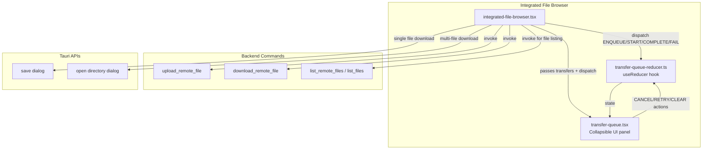

# Design Document: SSH File Browser Reimplementation

## Overview

This design unifies the SSH integrated file browser's transfer experience with the proven patterns already in use by the dual-pane file browser. The core problem: `integrated-file-browser.tsx` manages transfers via ad-hoc `useState` calls, uses legacy `sftp_upload_file`/`sftp_download_file` commands that pass raw byte arrays through IPC, and lacks progress tracking, cancel/retry, and proper notifications. Meanwhile, `file-browser-view.tsx` already has a polished transfer system built on `transfer-queue-reducer.ts` and `transfer-queue.tsx`.

The approach is straightforward — adopt the existing reducer, reuse the existing UI component, switch to the unified backend commands (`upload_remote_file`, `download_remote_file`), add drag-and-drop from OS, integrate Tauri file picker dialogs for downloads, and remove the legacy `sftp-panel.tsx` dialog.

No new backend commands are needed. No new state management patterns are introduced. This is a frontend refactor that reuses existing infrastructure.

## Architecture

The reimplemented integrated file browser follows the same architecture as the dual-pane browser, adapted for a single-pane context:



### Key Architectural Decisions

1. **Reuse, don't rewrite**: `transfer-queue-reducer.ts` and `transfer-queue.tsx` are used as-is. No modifications needed to these modules.

2. **Single-pane adaptation**: Unlike the dual-pane browser which has local+remote panels with `TransferControls` arrows between them, the integrated browser is remote-only. Uploads come from OS drag-and-drop or file picker; downloads go to a user-chosen local path via Tauri dialogs.

3. **Sequential processing**: Same as dual-pane — one transfer at a time via `getNextQueuedTransfer`. This avoids overwhelming the SSH connection.

4. **Backend command switch**: The integrated browser currently uses `sftp_upload_file` (sends raw `Vec<u8>` through IPC) and `sftp_download_file` (returns raw `Vec<u8>` through IPC). These are replaced with `upload_remote_file` and `download_remote_file` which operate on file paths, matching the dual-pane browser's approach. This is more efficient for large files since data doesn't cross the IPC boundary.

5. **SFTP Panel removal**: `sftp-panel.tsx` is a dialog-based file browser opened from SSH sessions. It's fully superseded by the integrated file browser in the bottom panel. The import and state in `App.tsx` are removed.

## Components and Interfaces

### Modified Components

#### `integrated-file-browser.tsx` (Major Refactor)

Current state management replaced:
```typescript
// BEFORE (ad-hoc useState)
const [transfers, setTransfers] = useState<TransferItem[]>([]);

// AFTER (reducer pattern)
const [transfers, dispatchTransfer] = useReducer(transferQueueReducer, []);
const [queueExpanded, setQueueExpanded] = useState(false);
```

New imports added:
```typescript
import { transferQueueReducer, getNextQueuedTransfer } from "@/lib/transfer-queue-reducer";
import { TransferQueue } from "./transfer-queue";
import { save, open } from "@tauri-apps/plugin-dialog";
```

Key interface changes:
- Remove local `TransferItem` type definition (use the one from `transfer-queue-reducer.ts`)
- Remove local `FileItem` type (migrate to `FileEntry` from `file-entry-types.tsx` where possible, or keep for `list_files` parsing)
- Add transfer processing `useEffect` (modeled on `file-browser-view.tsx`)
- Replace inline transfer queue UI with `<TransferQueue>` component
- Add OS drag-and-drop handler for file uploads
- Add Tauri dialog integration for downloads

#### Transfer Processing Loop

Modeled directly on `file-browser-view.tsx`:

```typescript
const processTransferRef = useRef(false);

useEffect(() => {
  const nextItem = getNextQueuedTransfer(transfers);
  if (!nextItem || processTransferRef.current) return;

  processTransferRef.current = true;
  dispatchTransfer({ type: "START", id: nextItem.id });

  const doTransfer = async () => {
    try {
      if (nextItem.direction === "upload") {
        const result = await invoke<{ success: boolean; error?: string }>(
          "upload_remote_file",
          { connectionId, localPath: nextItem.sourcePath, remotePath: nextItem.destinationPath }
        );
        // dispatch COMPLETE or FAIL based on result
      } else {
        const result = await invoke<{ success: boolean; error?: string }>(
          "download_remote_file",
          { connectionId, remotePath: nextItem.sourcePath, localPath: nextItem.destinationPath }
        );
        // dispatch COMPLETE or FAIL, show toast with Open File / Show in Folder actions
      }
    } catch (err) {
      dispatchTransfer({ type: "FAIL", id: nextItem.id, error: String(err) });
    } finally {
      processTransferRef.current = false;
    }
  };
  doTransfer();
}, [transfers, connectionId]);
```

#### Download Workflow

Single file download via context menu:
```typescript
const handleDownload = async (file: FileItem) => {
  // Use Tauri save dialog for single file
  const destPath = await save({ defaultPath: file.name });
  if (!destPath) return; // User cancelled

  dispatchTransfer({
    type: "ENQUEUE",
    items: [{ fileName: file.name, direction: "download", sourcePath: file.path, destinationPath: destPath, totalBytes: file.size }],
  });
};
```

Multi-file download:
```typescript
const handleDownloadMultiple = async (files: FileItem[]) => {
  const destDir = await open({ directory: true });
  if (!destDir) return;

  dispatchTransfer({
    type: "ENQUEUE",
    items: files.map(f => ({
      fileName: f.name,
      direction: "download" as const,
      sourcePath: f.path,
      destinationPath: `${destDir}/${f.name}`,
      totalBytes: f.size,
    })),
  });
  toast.info(`Queued ${files.length} file(s) for download`);
};
```

#### OS Drag-and-Drop Upload

The integrated browser already has drag-and-drop handling, but it reads file bytes and sends them via `sftp_upload_file`. The new approach:

1. Accept dropped files from OS
2. For each file, use the Tauri `path` API or the file's `path` property to get the local filesystem path
3. Enqueue uploads using `upload_remote_file` (path-based, no byte array IPC)

For browser-based drag-and-drop where we only get `File` objects (no filesystem path), we need a fallback: write the file to a temp directory first via Tauri, then use `upload_remote_file`. Alternatively, use `@tauri-apps/plugin-fs` to write to a temp path.

Directory drops show an informational toast since recursive upload isn't supported via this path.

#### `App.tsx` (Minor Changes)

- Remove `import { SFTPPanel } from './components/sftp-panel'`
- Remove `sftpPanelOpen` state and `setSftpPanelOpen`
- Remove `handleOpenSFTP` callback
- Remove `<SFTPPanel>` JSX
- Remove any menu item / keyboard shortcut that triggers the SFTP panel

#### `sftp-panel.tsx` (Deprecated)

File retained but not imported anywhere. Add deprecation comment at top:
```typescript
/** @deprecated Use IntegratedFileBrowser instead. This component is no longer mounted. */
```

### Unchanged Components (Reused As-Is)

- `transfer-queue-reducer.ts` — All action types, selectors, and reducer logic already support the full lifecycle needed
- `transfer-queue.tsx` — The `TransferQueue` component accepts `transfers`, `dispatch`, `expanded`, and `onToggleExpanded` props. It renders the collapsible panel with all the columns, badges, action buttons, and auto-expand behavior
- `file-entry-types.tsx` — Shared types and helpers

## Data Models

### Transfer State (Existing — No Changes)

From `transfer-queue-reducer.ts`:

```typescript
interface TransferItem {
  id: string;
  fileName: string;
  direction: "upload" | "download";
  sourcePath: string;
  destinationPath: string;
  status: "queued" | "transferring" | "completed" | "failed" | "cancelled";
  progress: number;        // 0-100
  bytesTransferred: number;
  totalBytes: number;
  speed: number;           // bytes/sec
  error?: string;
  startedAt?: number;
  completedAt?: number;
}
```

### Transfer Actions (Existing — No Changes)

```typescript
type TransferAction =
  | { type: "ENQUEUE"; items: Array<{ fileName, direction, sourcePath, destinationPath, totalBytes }> }
  | { type: "START"; id: string }
  | { type: "PROGRESS"; id, progress, bytesTransferred, speed }
  | { type: "COMPLETE"; id: string }
  | { type: "FAIL"; id: string; error: string }
  | { type: "CANCEL"; id: string }
  | { type: "RETRY"; id: string }
  | { type: "CLEAR_COMPLETED" }
  | { type: "CLEAR_ALL" };
```

### Backend Command Signatures (Existing — No Changes)

```rust
// Upload: reads local file, writes to remote via SFTP/FTP
fn upload_remote_file(connection_id: String, local_path: String, remote_path: String)
  -> Result<FileTransferResponse, String>

// Download: reads remote file via SFTP/FTP, writes to local path
fn download_remote_file(connection_id: String, remote_path: String, local_path: String)
  -> Result<FileTransferResponse, String>

// FileTransferResponse { success: bool, bytes_transferred: Option<u64>, error: Option<String> }
```

### File Item Type (Integrated Browser — Internal)

The integrated browser's `FileItem` type is kept for parsing `list_files` output (which returns raw `ls -la` text). This is different from the `FileEntry` type used by the dual-pane browser (which uses `list_remote_files` returning structured data). A future improvement could switch to `list_remote_files`, but that requires the SSH connection to also have an SFTP subsystem connection registered in the connection manager, which is a separate concern.

```typescript
interface FileItem {
  name: string;
  type: "file" | "directory";
  size: number;
  modified: Date;
  permissions: string;
  owner: string;
  group: string;
  path: string;
}
```

## Correctness Properties

*A property is a characteristic or behavior that should hold true across all valid executions of a system — essentially, a formal statement about what the system should do. Properties serve as the bridge between human-readable specifications and machine-verifiable correctness guarantees.*

The transfer queue reducer (`transfer-queue-reducer.ts`) is the core state machine for this feature. Since the integrated file browser reuses it without modification, the properties below validate that the reducer correctly manages the transfer lifecycle. These properties already hold for the dual-pane browser and must continue to hold when the integrated browser adopts the same reducer.

### Property 1: ENQUEUE preserves all input fields and produces correct item count

*For any* array of N file transfer descriptors (each with a fileName, direction, sourcePath, destinationPath, and totalBytes), dispatching an ENQUEUE action on any existing transfer state should produce a new state where: (a) the state length increased by exactly N, (b) each new item has status "queued", progress 0, bytesTransferred 0, speed 0, and (c) each new item's fileName, direction, sourcePath, destinationPath, and totalBytes match the corresponding input descriptor.

**Validates: Requirements 1.2, 1.3, 1.4, 6.3**

### Property 2: Sequential transfer enforcement

*For any* transfer state, `getNextQueuedTransfer` returns `undefined` if any item has status "transferring". If no item is "transferring", it returns the first item with status "queued" (in insertion order). If no items are "queued", it returns `undefined`.

**Validates: Requirements 1.5**

### Property 3: COMPLETE sets terminal state correctly

*For any* transfer state containing an item with status "transferring", dispatching a COMPLETE action for that item's ID should set its status to "completed", its progress to 100, and assign a `completedAt` timestamp. All other items in the state should remain unchanged.

**Validates: Requirements 2.2, 7.4**

### Property 4: FAIL stores error and sets terminal state

*For any* transfer state containing an item, and *for any* non-empty error string, dispatching a FAIL action for that item's ID should set its status to "failed", store the error string, and assign a `completedAt` timestamp. All other items should remain unchanged.

**Validates: Requirements 2.3, 7.3**

### Property 5: CANCEL transitions non-completed items

*For any* transfer state and *for any* item that does not have status "completed", dispatching a CANCEL action for that item's ID should set its status to "cancelled" and assign a `completedAt` timestamp. Items with status "completed" should be unaffected by CANCEL. All other items should remain unchanged.

**Validates: Requirements 3.2**

### Property 6: RETRY resets failed or cancelled items to queued

*For any* transfer state containing an item with status "failed" or "cancelled", dispatching a RETRY action for that item's ID should reset its status to "queued", progress to 0, bytesTransferred to 0, speed to 0, error to undefined, startedAt to undefined, and completedAt to undefined. Items with any other status should be unaffected by RETRY.

**Validates: Requirements 3.4**

### Property 7: CLEAR_COMPLETED removes only terminal-state items

*For any* transfer state, dispatching a CLEAR_COMPLETED action should remove all items with status "completed", "failed", or "cancelled", and retain all items with status "queued" or "transferring" in their original order and with unchanged fields.

**Validates: Requirements 3.5**

### Property 8: Active transfer count accuracy

*For any* transfer state, `getActiveTransferCount` should return the exact count of items whose status is "queued" or "transferring".

**Validates: Requirements 2.5, 9.4**

## Error Handling

### Transfer Errors

| Error Scenario | Handling |
|---|---|
| Backend command returns `{ success: false, error: "..." }` | Dispatch `FAIL` action with the error message. Show error toast with file name and reason. |
| Backend command throws (network error, IPC failure) | Catch in try/catch, dispatch `FAIL` with `err.message`. Show error toast. |
| Tauri file dialog cancelled by user | No-op. Do not enqueue any transfers. No toast. |
| Directory dropped onto browser | Show informational toast: "Directory upload is not supported via drag-and-drop. Use the upload button." Do not enqueue. |
| Connection lost during transfer | The backend command will fail. Same handling as command failure above. The `isConnected` prop disables UI interactions. |
| Empty file selection for download | Guard: if no files selected, return early. No toast. |

### File Listing Errors

The existing `loadFiles` function already handles errors with `toast.error`. No changes needed.

### State Recovery

- Failed/cancelled transfers can be retried via the RETRY action, which resets them to "queued"
- The transfer processing loop (`useEffect`) automatically picks up retried items
- `CLEAR_ALL` keeps only "transferring" items, providing a way to reset the queue without losing in-progress work

## Testing Strategy

### Dual Testing Approach

This feature uses both unit tests and property-based tests for comprehensive coverage:

- **Property-based tests** (via `fast-check`): Validate the 8 correctness properties above against the `transferQueueReducer` and its selectors. Each property test generates random transfer states and actions to verify universal invariants.
- **Unit tests** (via Vitest): Cover specific examples, edge cases, and integration points that aren't well-suited to property testing (e.g., component rendering, toast notifications, Tauri command mocking).

### Property-Based Testing Configuration

- **Library**: `fast-check` (already a project dependency)
- **Runner**: Vitest with `globals: true`
- **Minimum iterations**: 100 per property test
- **Tag format**: Each test tagged with a comment: `// Feature: ssh-file-browser-reimpl, Property N: <title>`
- **Each correctness property is implemented by a single property-based test**

### Test File Organization

- Property tests: `src/__tests__/ssh-file-browser-transfer.property.test.ts`
- Unit tests: `src/__tests__/ssh-file-browser-integration.test.tsx` (component tests with mocked Tauri commands)

### Property Test Generators

Custom `fast-check` arbitraries needed:

```typescript
// Generate a random TransferItem
const transferItemArb = fc.record({
  id: fc.string({ minLength: 1 }),
  fileName: fc.string({ minLength: 1 }),
  direction: fc.constantFrom("upload", "download"),
  sourcePath: fc.string({ minLength: 1 }),
  destinationPath: fc.string({ minLength: 1 }),
  status: fc.constantFrom("queued", "transferring", "completed", "failed", "cancelled"),
  progress: fc.integer({ min: 0, max: 100 }),
  bytesTransferred: fc.nat(),
  totalBytes: fc.nat(),
  speed: fc.nat(),
  error: fc.option(fc.string()),
  startedAt: fc.option(fc.nat()),
  completedAt: fc.option(fc.nat()),
});

// Generate a random transfer state (array of TransferItems)
const transferStateArb = fc.array(transferItemArb, { maxLength: 20 });

// Generate ENQUEUE input items
const enqueueItemArb = fc.record({
  fileName: fc.string({ minLength: 1 }),
  direction: fc.constantFrom("upload", "download"),
  sourcePath: fc.string({ minLength: 1 }),
  destinationPath: fc.string({ minLength: 1 }),
  totalBytes: fc.nat(),
});
```

### Unit Test Coverage

Key unit test scenarios:
- Component renders `TransferQueue` when transfers exist
- Drag-and-drop shows overlay on dragEnter, hides on dragLeave
- Context menu download triggers Tauri save dialog
- Multi-file download triggers Tauri open-directory dialog
- Upload via file picker enqueues transfers correctly
- SFTP panel is no longer rendered in App.tsx
- Legacy commands (`sftp_upload_file`, `sftp_download_file`) are not called by the integrated browser
