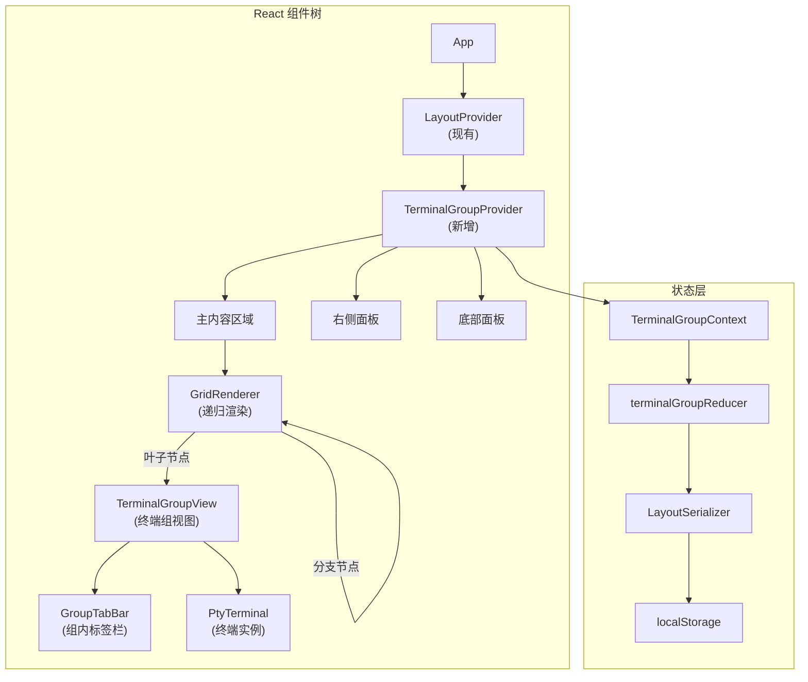
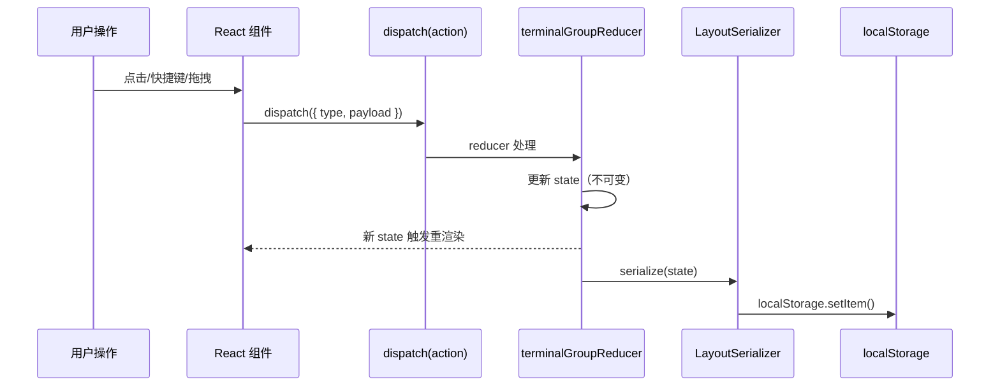

# 设计文档：终端分屏视图

## 概述

本设计为 R-Shell 实现类似 VSCode 的终端分屏系统。核心思路是引入 `TerminalGroupManager` 作为中央状态管理器，使用 React Context 提供全局状态访问，通过递归网格布局树（GridNode）驱动 `react-resizable-panels` 渲染嵌套的可调整大小面板。

当前 App.tsx 中的扁平 `tabs[]` + `activeTabId` 状态将被替换为 `TerminalGroupManager` 管理的多组状态。右侧面板（SystemMonitor、LogViewer）和底部面板（FileBrowser）通过订阅"当前活动连接"派生状态实现联动。

### 技术选型

- **布局渲染**：复用已有的 `react-resizable-panels`（ResizablePanelGroup / ResizablePanel / ResizableHandle）
- **拖拽**：使用 HTML5 Drag and Drop API（无需额外依赖）
- **状态管理**：React Context + useReducer（与现有 LayoutContext 模式一致）
- **序列化**：JSON.stringify/parse 存储到 localStorage
- **属性测试**：使用已安装的 `fast-check` 库

## 架构

### 整体架构图



### 状态流转



## 组件与接口

### 1. 核心数据类型（`src/lib/terminal-group-types.ts`）

```typescript
/** 分屏方向 */
export type SplitDirection = 'up' | 'down' | 'left' | 'right';

/** 网格布局节点 */
export type GridNode =
  | { type: 'leaf'; groupId: string }
  | { type: 'branch'; direction: 'horizontal' | 'vertical'; children: GridNode[]; sizes: number[] };

/** 终端标签页 */
export interface TerminalTab {
  id: string;
  name: string;
  protocol?: string;
  host?: string;
  username?: string;
  originalConnectionId?: string;
  connectionStatus: 'connected' | 'connecting' | 'disconnected';
  reconnectCount: number;
}

/** 终端组 */
export interface TerminalGroup {
  id: string;
  tabs: TerminalTab[];
  activeTabId: string | null;
}

/** 完整布局状态 */
export interface TerminalGroupState {
  groups: Record<string, TerminalGroup>;
  activeGroupId: string;
  gridLayout: GridNode;
  nextGroupId: number;
}
```

### 2. Reducer Actions（`src/lib/terminal-group-actions.ts`）

```typescript
export type TerminalGroupAction =
  | { type: 'SPLIT_GROUP'; groupId: string; direction: SplitDirection; newTab?: TerminalTab }
  | { type: 'REMOVE_GROUP'; groupId: string }
  | { type: 'ACTIVATE_GROUP'; groupId: string }
  | { type: 'ADD_TAB'; groupId: string; tab: TerminalTab }
  | { type: 'REMOVE_TAB'; groupId: string; tabId: string }
  | { type: 'ACTIVATE_TAB'; groupId: string; tabId: string }
  | { type: 'MOVE_TAB'; sourceGroupId: string; targetGroupId: string; tabId: string; targetIndex?: number }
  | { type: 'REORDER_TAB'; groupId: string; fromIndex: number; toIndex: number }
  | { type: 'CLOSE_OTHER_TABS'; groupId: string; tabId: string }
  | { type: 'CLOSE_TABS_TO_RIGHT'; groupId: string; tabId: string }
  | { type: 'CLOSE_TABS_TO_LEFT'; groupId: string; tabId: string }
  | { type: 'MOVE_TAB_TO_NEW_GROUP'; groupId: string; tabId: string; direction: SplitDirection }
  | { type: 'UPDATE_TAB_STATUS'; tabId: string; status: 'connected' | 'connecting' | 'disconnected' }
  | { type: 'UPDATE_GRID_SIZES'; path: number[]; sizes: number[] }
  | { type: 'RESET_LAYOUT' }
  | { type: 'RESTORE_LAYOUT'; state: TerminalGroupState };
```

### 3. Reducer 实现（`src/lib/terminal-group-reducer.ts`）


核心 reducer 函数，处理所有终端组状态变更。关键逻辑：

```typescript
/**
 * terminalGroupReducer - 终端组状态 reducer
 * 
 * 处理所有终端组相关的状态变更，包括分屏、标签页管理、布局调整等。
 * 所有操作均为不可变更新，返回新的状态对象。
 * 
 * @param state - 当前终端组状态
 * @param action - 要执行的操作
 * @returns 新的终端组状态
 */
export function terminalGroupReducer(
  state: TerminalGroupState,
  action: TerminalGroupAction
): TerminalGroupState;
```

关键 action 处理逻辑：

- **SPLIT_GROUP**：在网格布局树中找到目标组的叶子节点，将其替换为分支节点（包含原组和新组）。方向映射：left/right → horizontal，up/down → vertical。新组放置位置由方向决定（right/down 放后面，left/up 放前面）。
- **REMOVE_GROUP**：从 groups 中删除该组，在网格树中移除对应叶子节点。如果父分支节点只剩一个子节点，则用该子节点替换父节点（树简化）。如果移除后无组，保留一个空组。
- **MOVE_TAB**：从源组移除标签页，添加到目标组的指定位置。如果源组变空，触发 REMOVE_GROUP 逻辑。
- **UPDATE_GRID_SIZES**：通过路径（path）定位到网格树中的分支节点，更新其 sizes 数组。

### 连接管理器双击连接行为

当用户从连接管理器双击连接时，`handleConnectionConnect` 的处理逻辑：

1. 遍历所有终端组的标签页（`allTabs`），查找是否已存在匹配 `connection.id` 的标签页
2. **已存在**：遍历 `state.groups` 找到包含该标签页的组，依次 dispatch `ACTIVATE_GROUP` 和 `ACTIVATE_TAB`
3. **不存在**：建立 SSH 连接，成功后 dispatch `ADD_TAB` 到 `state.activeGroupId`（当前活动组）

### 4. Context Provider（`src/lib/terminal-group-context.tsx`）

```typescript
/**
 * TerminalGroupContext - 终端组全局状态上下文
 * 
 * 提供终端组状态和操作方法给所有子组件。
 * 内部使用 useReducer 管理状态，并在状态变化时自动持久化到 localStorage。
 */
interface TerminalGroupContextType {
  state: TerminalGroupState;
  dispatch: React.Dispatch<TerminalGroupAction>;
  
  /** 当前活动组 */
  activeGroup: TerminalGroup | null;
  /** 当前活动标签页 */
  activeTab: TerminalTab | null;
  /** 当前活动连接信息（驱动面板联动） */
  activeConnection: {
    connectionId: string;
    name: string;
    protocol: string;
    host?: string;
    username?: string;
    status: 'connected' | 'connecting' | 'disconnected';
  } | null;
}
```

Provider 内部逻辑：
- 初始化时从 localStorage 恢复状态（通过 LayoutSerializer）
- 状态变化时通过 useEffect 自动保存到 localStorage
- 派生 `activeConnection` 供面板联动使用
- 处理状态迁移（检测旧版数据格式）

### 5. 布局序列化器（`src/lib/terminal-group-serializer.ts`）

```typescript
const STORAGE_KEY = 'r-shell-terminal-groups';
const STATE_VERSION = 1;

interface SerializedState {
  version: number;
  data: TerminalGroupState;
}

/**
 * serialize - 将终端组状态序列化为 JSON 字符串
 * 
 * 仅保存布局结构和标签页元数据，不保存运行时状态。
 * 添加版本号用于未来的数据迁移。
 * 
 * @param state - 终端组状态
 * @returns JSON 字符串
 */
export function serialize(state: TerminalGroupState): string;

/**
 * deserialize - 从 JSON 字符串反序列化终端组状态
 * 
 * 验证版本号和数据完整性。如果数据损坏或版本不兼容，返回 null。
 * 
 * @param json - JSON 字符串
 * @returns 终端组状态，或 null（数据无效时）
 */
export function deserialize(json: string): TerminalGroupState | null;

/**
 * saveState - 保存状态到 localStorage
 */
export function saveState(state: TerminalGroupState): void;

/**
 * loadState - 从 localStorage 加载状态
 * 
 * 包含旧版数据检测和迁移逻辑：
 * - 检查是否存在旧版 key（r-shell-layout-config 中无 version 字段）
 * - 检查旧版 active-connections key
 * - 如果检测到旧版数据，清除旧数据并返回 null
 * 
 * @returns 终端组状态，或 null（无数据/旧版数据时）
 */
export function loadState(): TerminalGroupState | null;

/**
 * createDefaultState - 创建默认的单终端组状态
 */
export function createDefaultState(): TerminalGroupState;

/**
 * migrateFromLegacy - 检测并清除旧版状态数据
 * 
 * 检查 localStorage 中的旧版 key：
 * - 'r-shell-active-connections'（旧版活动连接）
 * - 检查布局数据是否缺少 version 字段
 * 
 * 如果检测到旧版数据，清除相关 key 并记录日志。
 * 保留 ConnectionData 不受影响。
 */
export function migrateFromLegacy(): void;
```

### 6. 网格布局渲染器（`src/components/terminal/grid-renderer.tsx`）

```typescript
/**
 * GridRenderer - 递归渲染网格布局树
 * 
 * 将 GridNode 树结构递归渲染为嵌套的 ResizablePanelGroup。
 * 叶子节点渲染为 TerminalGroupView，分支节点渲染为 ResizablePanelGroup。
 * 
 * @param node - 当前网格节点
 * @param path - 当前节点在树中的路径（用于 UPDATE_GRID_SIZES）
 */
interface GridRendererProps {
  node: GridNode;
  path: number[];
}

export function GridRenderer({ node, path }: GridRendererProps): JSX.Element;
```

渲染逻辑：
- **叶子节点**：渲染 `<TerminalGroupView groupId={node.groupId} />`
- **分支节点**：渲染 `<ResizablePanelGroup direction={node.direction}>`，对每个子节点递归渲染 `<ResizablePanel>` + `<ResizableHandle>`
- 分隔条双击事件：dispatch `UPDATE_GRID_SIZES` 设置均等大小

### 7. 终端组视图（`src/components/terminal/terminal-group-view.tsx`）

```typescript
/**
 * TerminalGroupView - 单个终端组的完整视图
 * 
 * 包含标签栏和终端内容区域。
 * 处理组的激活（点击时 dispatch ACTIVATE_GROUP）。
 * 根据是否为活动组显示不同的选中效果。
 * 作为拖拽放置目标，显示方向性 DropZone。
 * 
 * @param groupId - 终端组 ID
 */
interface TerminalGroupViewProps {
  groupId: string;
}

export function TerminalGroupView({ groupId }: TerminalGroupViewProps): JSX.Element;
```

选中效果实现：
- 活动组：`border-2 border-primary` + 标签栏 `bg-background`
- 非活动组：`border border-border` + 标签栏 `bg-muted`

### 8. 组内标签栏（`src/components/terminal/group-tab-bar.tsx`）

```typescript
/**
 * GroupTabBar - 终端组内的标签栏
 * 
 * 复用现有 ConnectionTabs 的视觉风格，但增加拖拽支持。
 * 每个标签页可拖拽（draggable），标签栏可接收拖拽（drop target）。
 * 
 * @param groupId - 所属终端组 ID
 * @param tabs - 标签页列表
 * @param activeTabId - 当前活动标签页 ID
 */
interface GroupTabBarProps {
  groupId: string;
  tabs: TerminalTab[];
  activeTabId: string | null;
}

export function GroupTabBar({ groupId, tabs, activeTabId }: GroupTabBarProps): JSX.Element;
```

拖拽实现：
- `onDragStart`：设置 `dataTransfer` 数据（tabId, sourceGroupId）
- `onDragOver`：计算插入位置，显示插入指示线
- `onDrop`：dispatch `MOVE_TAB` 或 `REORDER_TAB`

### 9. 拖拽放置区域（`src/components/terminal/drop-zone-overlay.tsx`）

```typescript
/**
 * DropZoneOverlay - 拖拽时显示的方向性放置区域覆盖层
 * 
 * 当标签页被拖拽到终端组内容区域时显示。
 * 将内容区域分为 5 个区域：上、下、左、右、中心。
 * 鼠标位置决定高亮哪个区域。
 * 
 * @param groupId - 目标终端组 ID
 * @param onDrop - 放置回调，参数为放置方向或 'center'
 */
interface DropZoneOverlayProps {
  groupId: string;
  visible: boolean;
  onDrop: (zone: SplitDirection | 'center') => void;
}

export function DropZoneOverlay({ groupId, visible, onDrop }: DropZoneOverlayProps): JSX.Element;
```

区域计算：将内容区域按比例划分，鼠标距离边缘 25% 以内为方向区域，中心为 center。

### 10. 快捷键扩展（`src/lib/keyboard-shortcuts.ts` 扩展）

```typescript
/**
 * createSplitViewShortcuts - 创建分屏相关的键盘快捷键
 * 
 * 扩展现有的 createLayoutShortcuts，添加分屏操作快捷键。
 * 
 * @param actions - 快捷键动作回调
 * @returns KeyboardShortcut 数组
 */
export const createSplitViewShortcuts = (actions: {
  splitRight: () => void;          // Ctrl+\
  splitDown: () => void;           // Ctrl+Shift+\
  focusGroup: (index: number) => void;  // Ctrl+1~9
  closeTab: () => void;            // Ctrl+W
  nextTab: () => void;             // Ctrl+Tab
  prevTab: () => void;             // Ctrl+Shift+Tab
}): KeyboardShortcut[];
```

## 数据模型

### 状态结构示例

```json
{
  "groups": {
    "1": {
      "id": "1",
      "tabs": [
        {
          "id": "conn-abc",
          "name": "Production Server",
          "protocol": "SSH",
          "host": "192.168.1.100",
          "username": "admin",
          "connectionStatus": "connected",
          "reconnectCount": 0
        }
      ],
      "activeTabId": "conn-abc"
    },
    "2": {
      "id": "2",
      "tabs": [
        {
          "id": "conn-def",
          "name": "Dev Server",
          "protocol": "SSH",
          "host": "192.168.1.101",
          "username": "dev",
          "connectionStatus": "connected",
          "reconnectCount": 0
        }
      ],
      "activeTabId": "conn-def"
    }
  },
  "activeGroupId": "1",
  "gridLayout": {
    "type": "branch",
    "direction": "horizontal",
    "children": [
      { "type": "leaf", "groupId": "1" },
      { "type": "leaf", "groupId": "2" }
    ],
    "sizes": [50, 50]
  },
  "nextGroupId": 3
}
```

### 网格树操作的不变量

1. **叶子-组一致性**：网格树中每个叶子节点的 `groupId` 必须在 `groups` 中存在，且 `groups` 中每个组必须在网格树中有对应的叶子节点。
2. **分支节点约束**：每个分支节点至少有 2 个子节点，`sizes` 数组长度等于 `children` 数组长度。
3. **活动组有效性**：`activeGroupId` 必须指向 `groups` 中存在的组。
4. **sizes 归一化**：每个分支节点的 `sizes` 数组之和应接近 100（百分比）。


## 正确性属性

*正确性属性是一种在系统所有有效执行中都应成立的特征或行为——本质上是关于系统应该做什么的形式化陈述。属性是人类可读规范与机器可验证正确性保证之间的桥梁。*

以下属性基于需求文档中的验收标准推导而来，经过冗余消除和合并后得到 15 个独立属性。

### Property 1: 分屏操作有效性

*For any* 有效的终端组状态和任意分屏方向，对任意存在的终端组执行 SPLIT_GROUP 操作后，组的总数应增加 1，新组应出现在网格树中对应的位置，且网格树结构保持有效（所有叶子节点对应存在的组）。

**Validates: Requirements 1.1, 3.2**

### Property 2: 空终端组自动移除不变量

*For any* 包含多个终端组的状态，当某个终端组的最后一个标签页被移除（通过 REMOVE_TAB 或 MOVE_TAB）后，该空终端组应被自动从 groups 和网格树中移除。但当只剩一个终端组时，该组应被保留（即使为空）。

**Validates: Requirements 1.2, 1.5, 4.6**

### Property 3: 终端组激活

*For any* 有效状态和任意存在的终端组 ID，执行 ACTIVATE_GROUP 后，activeGroupId 应等于该组 ID，且状态中其他数据不受影响。

**Validates: Requirements 1.3, 7.3**

### Property 4: 终端组 ID 唯一性不变量

*For any* 有效的初始状态和任意操作序列（SPLIT_GROUP、REMOVE_GROUP、MOVE_TAB_TO_NEW_GROUP 等），执行后所有终端组的 ID 应保持互不相同。

**Validates: Requirements 1.4**

### Property 5: 组内标签页激活

*For any* 终端组和该组内任意标签页，执行 ACTIVATE_TAB 后，该组的 activeTabId 应等于目标标签页 ID，且该组的标签页列表不变。

**Validates: Requirements 2.1**

### Property 6: 关闭标签页后的相邻激活

*For any* 包含多个标签页的终端组，关闭当前活动标签页后，新的活动标签页应为：若原活动标签页右侧有标签页则激活右侧第一个，否则激活左侧第一个。

**Validates: Requirements 2.2**

### Property 7: 方向性标签页关闭

*For any* 终端组和该组内任意标签页位置 i：
- CLOSE_OTHER_TABS 后，组内应仅剩位置 i 的标签页
- CLOSE_TABS_TO_RIGHT 后，组内应仅保留位置 0 到 i 的标签页
- CLOSE_TABS_TO_LEFT 后，组内应仅保留位置 i 到末尾的标签页

**Validates: Requirements 2.3, 2.4, 2.5**

### Property 8: 移动标签页到新组

*For any* 有效状态、任意终端组、该组内任意标签页和任意分屏方向，执行 MOVE_TAB_TO_NEW_GROUP 后：源组的标签页数量减少 1，新创建的组包含且仅包含被移动的标签页，网格树中新组出现在正确的方向位置。

**Validates: Requirements 2.6, 4.5**

### Property 9: 布局状态序列化往返一致性

*For any* 有效的 TerminalGroupState 对象，执行 serialize 后再 deserialize 应产生与原始对象深度相等的状态。

**Validates: Requirements 3.5, 3.6, 3.7**

### Property 10: 标签页重排序保持集合不变

*For any* 终端组和该组内任意两个有效位置 fromIndex 和 toIndex，执行 REORDER_TAB 后，组内标签页的集合（按 ID）应与操作前完全相同，仅顺序发生变化。

**Validates: Requirements 4.7**

### Property 11: 跨组移动标签页

*For any* 有效状态中的两个不同终端组和源组内任意标签页，执行 MOVE_TAB 后：源组的标签页数量减少 1，目标组的标签页数量增加 1，被移动的标签页出现在目标组中，且所有组的标签页总数不变。

**Validates: Requirements 4.4, 9.1, 9.2**

### Property 12: 损坏数据回退

*For any* 非有效 JSON 字符串或缺少 version 字段的 JSON 字符串，deserialize 应返回 null，系统应回退到默认的单终端组布局。

**Validates: Requirements 6.3**

### Property 13: 活动连接派生状态一致性

*For any* 有效的终端组状态，派生的 activeConnection 应满足：若 activeGroupId 对应的组存在且该组有活动标签页，则 activeConnection 的各字段（connectionId、name、protocol、host、username、status）应与该活动标签页的对应字段一致；若无活动标签页，则 activeConnection 应为 null。

**Validates: Requirements 8.1, 8.2, 8.3, 8.4**

### Property 14: 旧版数据迁移安全性

*For any* localStorage 中存在旧版格式数据（无 version 字段的布局数据或无 groupId 的活动连接数据），执行 migrateFromLegacy 后：旧版布局和活动连接数据应被清除，ConnectionData 存储应保持不变。

**Validates: Requirements 10.1, 10.2, 10.5**

### Property 15: 网格树结构不变量

*For any* 有效的终端组状态和任意操作（SPLIT_GROUP、REMOVE_GROUP、MOVE_TAB、MOVE_TAB_TO_NEW_GROUP 等），操作后的状态应满足：
1. 网格树中每个叶子节点的 groupId 在 groups 中存在
2. groups 中每个组在网格树中有且仅有一个对应的叶子节点
3. 每个分支节点至少有 2 个子节点
4. 每个分支节点的 sizes 长度等于 children 长度

**Validates: Requirements 1.1, 1.2, 2.6, 3.1**

## 错误处理

### 序列化/反序列化错误

| 错误场景 | 处理方式 |
|---------|---------|
| localStorage 写入失败（存储已满） | 捕获异常，console.warn 记录，不影响运行时状态 |
| JSON.parse 失败（数据损坏） | 返回 null，回退到默认布局 |
| 反序列化后数据结构不完整 | 验证关键字段，缺失则返回 null |
| 版本号不匹配 | 当前仅支持 version=1，未来版本可添加迁移逻辑 |

### 状态操作错误

| 错误场景 | 处理方式 |
|---------|---------|
| SPLIT_GROUP 目标组不存在 | 忽略操作，返回原状态 |
| REMOVE_TAB 目标标签页不存在 | 忽略操作，返回原状态 |
| MOVE_TAB 源组或目标组不存在 | 忽略操作，返回原状态 |
| ACTIVATE_GROUP 目标组不存在 | 忽略操作，返回原状态 |
| 快捷键目标组序号超出范围 | 忽略操作，不产生副作用 |

### 拖拽错误

| 错误场景 | 处理方式 |
|---------|---------|
| 拖拽数据格式无效 | 忽略 drop 事件 |
| 拖拽到自身同一位置 | 不执行任何操作 |
| 拖拽过程中源组被删除 | 取消拖拽操作 |

### 旧版数据迁移

| 错误场景 | 处理方式 |
|---------|---------|
| 旧版 key 存在但值为空 | 删除 key，初始化默认布局 |
| 旧版 key 存在且有数据 | 删除 key，记录日志，初始化默认布局 |
| 部分 key 为旧版部分为新版 | 清除所有旧版 key，保留新版数据 |

## 测试策略

### 属性测试（Property-Based Testing）

使用项目已安装的 `fast-check` 库进行属性测试。每个属性测试至少运行 100 次迭代。

**测试文件结构**：
- `src/__tests__/terminal-group-reducer.property.test.ts` — reducer 相关属性测试（Property 1-8, 10-11, 15）
- `src/__tests__/terminal-group-serializer.property.test.ts` — 序列化相关属性测试（Property 9, 12, 14）
- `src/__tests__/terminal-group-context.property.test.ts` — 派生状态属性测试（Property 13）

**生成器策略**：
- `arbitraryTerminalTab()` — 生成随机 TerminalTab（随机 ID、名称、协议、状态）
- `arbitraryTerminalGroup()` — 生成包含 1-5 个随机标签页的 TerminalGroup
- `arbitraryTerminalGroupState()` — 生成包含 1-4 个组的完整状态（含有效网格树）
- `arbitrarySplitDirection()` — 从 4 个方向中随机选择
- `arbitraryCorruptedJson()` — 生成各种损坏的 JSON 字符串

每个测试必须包含注释引用设计文档中的属性编号：
```typescript
// Feature: terminal-split-view, Property 1: 分屏操作有效性
```

### 单元测试

**测试文件结构**：
- `src/__tests__/terminal-group-reducer.test.ts` — reducer 边界情况和具体示例
- `src/__tests__/terminal-group-serializer.test.ts` — 序列化具体示例
- `src/__tests__/keyboard-shortcuts.test.ts` — 快捷键映射测试

**单元测试重点**：
- 双击分隔条重置为均等大小（需求 3.4）
- 重置布局操作（需求 6.4）
- 各快捷键映射正确性（需求 5.1, 5.3, 5.4, 5.5, 5.7）
- 旧版迁移日志记录（需求 10.4）
- 边界情况：空状态、单组单标签页、最大嵌套深度
