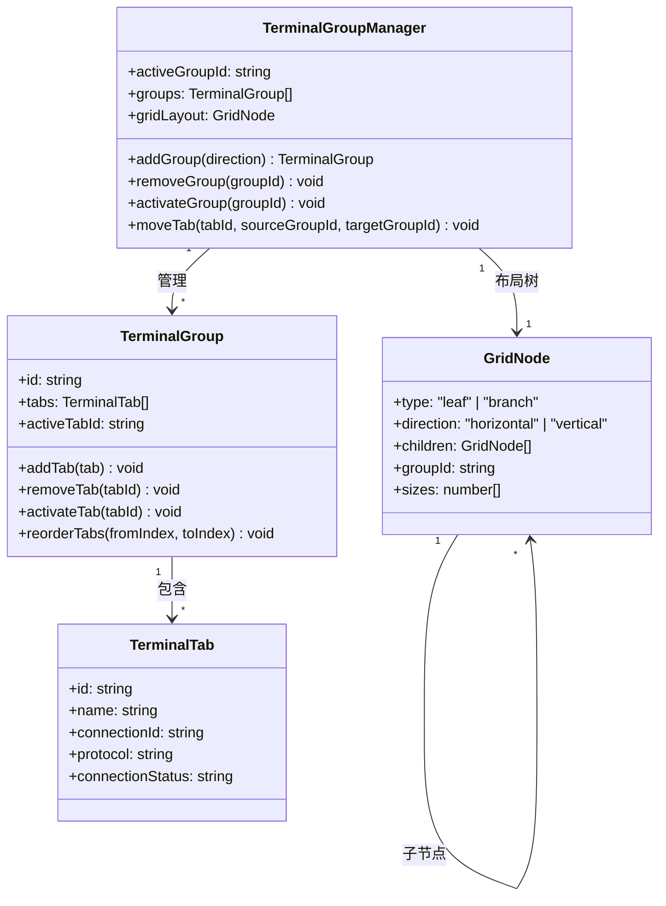
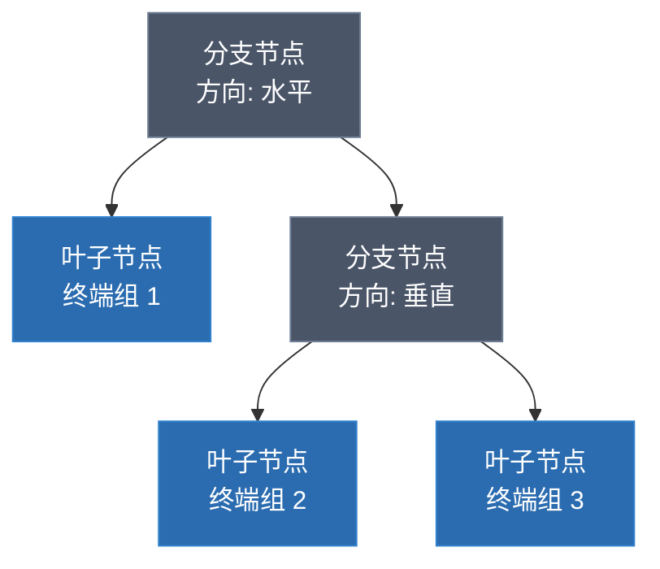
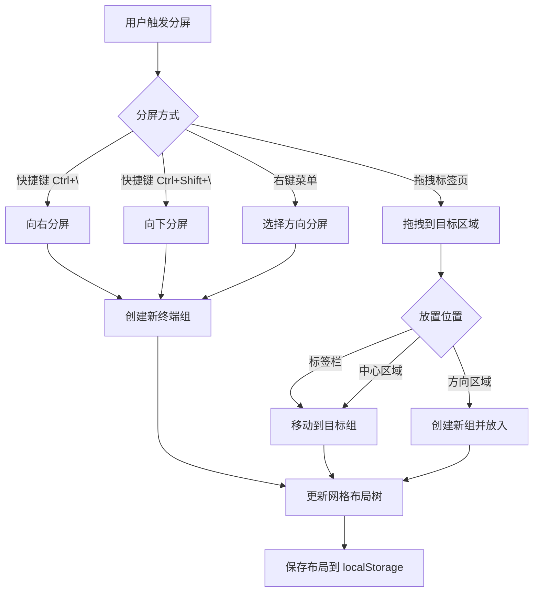
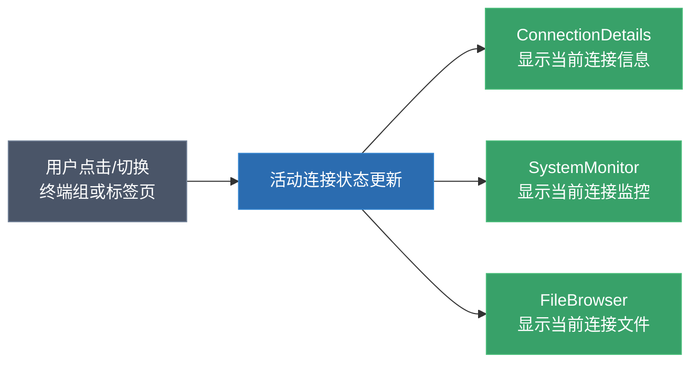
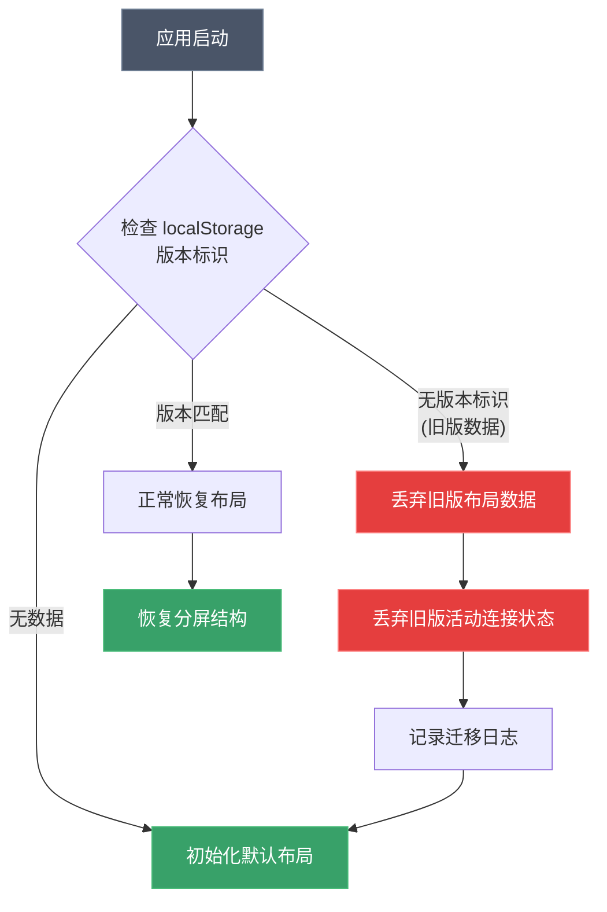

# 需求文档：终端分屏视图

## 简介

为 R-Shell（基于 Tauri 的 SSH 终端客户端）实现类似 VSCode 的编辑器分屏/标签页功能。当前应用仅支持平铺标签页切换，同一时间只能显示一个终端。本功能将引入编辑器组（EditorGroup）概念，支持多方向分屏、组内标签页管理、拖拽移动标签页、布局持久化和键盘快捷键操作，使用户能够同时查看和操作多个终端会话。

## 术语表

- **终端组（TerminalGroup）**：一个包含标签栏和终端显示区域的容器，类似 VSCode 的 EditorGroup。每个终端组独立管理自己的标签页列表和活动标签页。
- **终端标签页（TerminalTab）**：终端组内的单个连接标签页，对应一个 PtyTerminal 实例。
- **分屏方向（SplitDirection）**：分割终端组的方向，包括上（UP）、下（DOWN）、左（LEFT）、右（RIGHT）四个方向。
- **网格布局（GridLayout）**：基于递归树结构的布局系统，每个节点要么是叶子节点（终端组），要么是分支节点（分割容器）。
- **活动终端组（ActiveGroup）**：当前获得焦点的终端组，用户的输入和操作将作用于该组。
- **布局状态（LayoutState）**：描述所有终端组的排列方式、大小比例和标签页信息的完整状态对象。
- **拖拽区域（DropZone）**：标签页拖拽时目标终端组上显示的放置指示区域，指示标签页将被放置到的位置。
- **布局序列化器（LayoutSerializer）**：负责将布局状态转换为 JSON 格式并存储到 localStorage，以及从 localStorage 恢复布局状态的模块。

## 架构概览图

### 核心数据模型关系



### 网格布局树结构示例



上图对应的实际界面布局：

```
┌──────────────┬──────────────┐
│              │  终端组 2     │
│  终端组 1     │  [Tab A][Tab B]│
│  [Tab X]     ├──────────────┤
│              │  终端组 3     │
│              │  [Tab C]     │
└──────────────┴──────────────┘
```

### 分屏操作流程



### 标签页拖拽放置区域示意

```
拖拽标签页到终端组内容区域时显示的放置区域：

┌─────────────────────────┐
│          上 (UP)         │
│  ┌───────────────────┐  │
│  │                   │  │
│左│    中心 (CENTER)    │右│
│  │                   │  │
│  └───────────────────┘  │
│          下 (DOWN)       │
└─────────────────────────┘

- 上/下/左/右: 在该方向创建新终端组
- 中心: 将标签页添加到当前终端组
```

### 键盘快捷键一览

```
┌─────────────────────┬──────────────────────────┐
│ 快捷键               │ 功能                      │
├─────────────────────┼──────────────────────────┤
│ Ctrl + \            │ 向右分屏                   │
│ Ctrl + Shift + \    │ 向下分屏                   │
│ Ctrl + 1~9          │ 切换到第 N 个终端组         │
│ Ctrl + W            │ 关闭当前标签页              │
│ Ctrl + Tab          │ 切换到下一个标签页           │
│ Ctrl + Shift + Tab  │ 切换到上一个标签页           │
└─────────────────────┴──────────────────────────┘
```

### 面板联动示意



### 选中效果（Selected）示意

```
活动终端组（Selected）:
┌─ 2px primary 高亮边框 ──────────────┐
│ [Tab A] [Tab B*] ← 高亮标签栏背景    │
│ ┌─────────────────────────────────┐ │
│ │                                 │ │
│ │     PtyTerminal 内容区域         │ │
│ │                                 │ │
│ └─────────────────────────────────┘ │
└─────────────────────────────────────┘

非活动终端组:
┌─ 普通边框 ──────────────────────────┐
│ [Tab C] [Tab D]  ← 普通标签栏背景    │
│ ┌─────────────────────────────────┐ │
│ │                                 │ │
│ │     PtyTerminal 内容区域         │ │
│ │                                 │ │
│ └─────────────────────────────────┘ │
└─────────────────────────────────────┘
```

### 状态迁移策略



## 需求

### 需求 1：终端组的创建与管理

**用户故事：** 作为用户，我希望能够创建和管理多个终端组，以便同时查看多个终端会话。

#### 验收标准

1. WHEN 用户触发分屏操作（通过菜单、右键菜单或快捷键）时，THE 终端组管理器 SHALL 在指定方向（上、下、左、右）创建一个新的终端组，并将当前活动标签页的副本或新空标签页放入新组中。
2. WHEN 终端组中最后一个标签页被关闭时，THE 终端组管理器 SHALL 自动移除该空终端组，并将焦点转移到相邻的终端组。
3. WHEN 用户点击某个终端组内的区域时，THE 终端组管理器 SHALL 将该终端组设置为活动终端组，并提供视觉焦点指示。
4. THE 终端组管理器 SHALL 为每个终端组分配唯一的数字标识符，用于内部状态管理和布局序列化。
5. WHEN 只剩一个终端组且该组内无标签页时，THE 终端组管理器 SHALL 保留该终端组并显示欢迎界面，而非移除该组。

### 需求 2：终端组内的标签页管理

**用户故事：** 作为用户，我希望在每个终端组内独立管理标签页，以便灵活组织终端会话。

#### 验收标准

1. WHEN 用户在某个终端组内点击标签页时，THE 终端组 SHALL 将该标签页设置为该组的活动标签页，并在终端区域显示对应的 PtyTerminal 实例。
2. WHEN 用户在终端组内关闭标签页时，THE 终端组 SHALL 激活相邻的标签页（优先激活右侧标签页，若无右侧则激活左侧）。
3. WHEN 用户在终端组内通过右键菜单选择"关闭其他标签页"时，THE 终端组 SHALL 关闭该组内除选中标签页外的所有标签页。
4. WHEN 用户在终端组内通过右键菜单选择"关闭右侧标签页"时，THE 终端组 SHALL 关闭该组内选中标签页右侧的所有标签页。
5. WHEN 用户在终端组内通过右键菜单选择"关闭左侧标签页"时，THE 终端组 SHALL 关闭该组内选中标签页左侧的所有标签页。
6. WHEN 用户通过右键菜单选择"将标签页移动到新组"时，THE 终端组管理器 SHALL 将该标签页从当前组移除，并在指定方向创建新终端组来承载该标签页。

### 需求 3：网格布局系统

**用户故事：** 作为用户，我希望终端分屏采用灵活的网格布局，以便支持任意嵌套的分屏排列。

#### 验收标准

1. THE 网格布局系统 SHALL 使用递归树结构表示布局，其中叶子节点为终端组，分支节点为分割容器（包含方向和子节点列表）。
2. WHEN 用户在水平分割内再次进行垂直分割时，THE 网格布局系统 SHALL 正确创建嵌套的分割结构。
3. WHEN 用户拖动终端组之间的分隔条时，THE 网格布局系统 SHALL 实时调整相邻终端组的大小比例。
4. WHEN 用户双击分隔条时，THE 网格布局系统 SHALL 将相邻终端组的大小重置为均等分布。
5. THE 布局序列化器 SHALL 将完整的网格布局状态（包括树结构、各节点大小比例、每个终端组的标签页列表和活动标签页）序列化为 JSON 格式。
6. THE 布局序列化器 SHALL 从 JSON 格式反序列化并恢复完整的网格布局状态。
7. FOR ALL 有效的布局状态对象，序列化后再反序列化 SHALL 产生与原始对象等价的布局状态（往返一致性）。

### 需求 4：标签页拖拽功能

**用户故事：** 作为用户，我希望能够通过拖拽将标签页在不同终端组之间移动，以便快速重新组织终端布局。

#### 验收标准

1. WHEN 用户开始拖拽标签页时，THE 拖拽系统 SHALL 显示该标签页的拖拽预览，并在原位置显示占位指示。
2. WHEN 用户将标签页拖拽到另一个终端组的标签栏上时，THE 拖拽系统 SHALL 在目标位置显示插入指示线，并在释放时将标签页插入到该位置。
3. WHEN 用户将标签页拖拽到终端组的内容区域时，THE 拖拽系统 SHALL 显示方向性拖拽区域（上、下、左、右、中心），指示标签页将被放置到的分屏位置。
4. WHEN 用户将标签页拖拽到拖拽区域的中心区域并释放时，THE 拖拽系统 SHALL 将标签页添加到该终端组的标签页列表中。
5. WHEN 用户将标签页拖拽到拖拽区域的方向区域（上、下、左、右）并释放时，THE 拖拽系统 SHALL 在该方向创建新的终端组并将标签页放入其中。
6. WHEN 标签页从源终端组移出后该组变为空时，THE 终端组管理器 SHALL 自动移除该空终端组。
7. WHEN 用户在同一终端组的标签栏内拖拽标签页时，THE 拖拽系统 SHALL 重新排列该组内标签页的顺序。

### 需求 5：键盘快捷键

**用户故事：** 作为用户，我希望通过键盘快捷键快速执行分屏和终端组切换操作，以提高工作效率。

#### 验收标准

1. WHEN 用户按下 Ctrl+\\ 时，THE 快捷键系统 SHALL 将当前活动终端组向右分屏。
2. WHEN 用户按下 Ctrl+数字键（1-9）时，THE 快捷键系统 SHALL 将焦点切换到对应序号的终端组。
3. WHEN 用户按下 Ctrl+W 时，THE 快捷键系统 SHALL 关闭当前活动终端组中的活动标签页。
4. WHEN 用户按下 Ctrl+Tab 时，THE 快捷键系统 SHALL 在当前终端组内切换到下一个标签页。
5. WHEN 用户按下 Ctrl+Shift+Tab 时，THE 快捷键系统 SHALL 在当前终端组内切换到上一个标签页。
6. WHEN 目标终端组序号不存在时，THE 快捷键系统 SHALL 忽略该快捷键操作，不产生任何副作用。
7. WHEN 用户按下 Ctrl+Shift+\\ 时，THE 快捷键系统 SHALL 将当前活动终端组向下分屏。

### 需求 6：布局持久化与恢复

**用户故事：** 作为用户，我希望应用在关闭后重新打开时能恢复之前的分屏布局，以便无缝继续工作。

#### 验收标准

1. WHEN 布局发生变化（分屏、关闭组、调整大小、标签页变动）时，THE 布局持久化系统 SHALL 将当前布局状态保存到 localStorage。
2. WHEN 应用启动时，THE 布局持久化系统 SHALL 从 localStorage 读取上次保存的布局状态并恢复分屏结构。
3. IF localStorage 中的布局数据损坏或格式不兼容，THEN THE 布局持久化系统 SHALL 回退到默认的单终端组布局，并在控制台记录警告信息。
4. WHEN 用户选择"重置布局"操作时，THE 布局持久化系统 SHALL 清除保存的布局数据并恢复为默认的单终端组布局。
5. THE 布局持久化系统 SHALL 仅保存布局结构和标签页元数据（连接ID、名称、协议），不保存终端会话的运行时状态。

### 需求 7：终端组的选中与视觉反馈

**用户故事：** 作为用户，我希望分屏界面提供清晰的选中（Selected）效果和视觉反馈，以便我能快速识别当前活动的终端组和操作状态。

#### 验收标准

1. WHILE 某个终端组处于活动（Selected）状态时，THE 终端组 SHALL 在其边框上显示 2px 宽的高亮边框（使用主题的 primary 颜色），与非活动终端组形成明显的视觉区分。
2. WHILE 某个终端组处于活动（Selected）状态时，THE 终端组的标签栏 SHALL 显示与非活动组不同的背景色，以强化选中状态的视觉识别。
3. WHEN 用户点击非活动终端组时，THE 终端组管理器 SHALL 立即切换选中状态的视觉指示到被点击的终端组，同时移除原活动组的选中效果。
4. WHILE 标签页正在被拖拽时，THE 拖拽系统 SHALL 在有效的放置目标上显示半透明的蓝色覆盖层作为拖拽区域指示。
5. WHEN 终端组之间的分隔条被悬停时，THE 网格布局系统 SHALL 改变光标样式为对应方向的调整大小光标。
6. WHEN 终端组数量发生变化时，THE 网格布局系统 SHALL 使用平滑的过渡动画调整布局。

### 需求 8：面板联动（Connection Details、File Browser、Monitor）

**用户故事：** 作为用户，我希望右侧面板（Connection Details、System Monitor）和底部面板（File Browser）能跟随当前选中的终端组自动切换显示内容，以便我始终看到与当前终端对应的信息。

#### 验收标准

1. WHEN 活动终端组或活动标签页发生切换时，THE ConnectionDetails 面板 SHALL 自动更新为当前活动标签页对应的连接信息（名称、协议、主机、用户名、端口、连接状态）。
2. WHEN 活动终端组或活动标签页发生切换时，THE SystemMonitor 面板 SHALL 自动切换为当前活动标签页对应的连接的系统监控数据。
3. WHEN 活动终端组或活动标签页发生切换时，THE IntegratedFileBrowser 面板 SHALL 自动切换为当前活动标签页对应的连接的文件浏览器实例。
4. WHEN 当前活动标签页无连接（例如欢迎界面）时，THE 各联动面板 SHALL 显示"无活动连接"的占位状态。
5. THE 面板联动系统 SHALL 通过统一的"当前活动连接"状态源驱动所有面板的内容切换，确保各面板显示的连接信息一致。

### 需求 9：与现有系统的集成

**用户故事：** 作为用户，我希望分屏功能与现有的连接管理、终端配置和布局系统无缝集成。

#### 验收标准

1. WHEN 用户从连接管理器双击连接时，THE 终端组管理器 SHALL 首先在当前活动终端组中查找是否已存在该连接对应的标签页：
   - IF 该连接的标签页已存在于当前活动终端组中，THEN 激活该标签页（ACTIVATE_TAB）。
   - IF 该连接的标签页不存在于当前活动终端组中，THEN 在当前活动终端组中创建新的连接会话并添加为新标签页，该标签页成为该组的活动标签页（即使其他终端组中已存在该连接的标签页）。
2. WHEN 用户从连接管理器拖拽连接到特定终端组时，THE 终端组管理器 SHALL 在该目标终端组中打开新的连接标签页。
3. WHEN 终端外观配置（字体、主题等）发生变化时，THE 终端组管理器 SHALL 将变更应用到所有终端组中的所有 PtyTerminal 实例。
4. THE 终端组管理器 SHALL 与现有的 LayoutContext（侧边栏、底部面板的显示/隐藏）协同工作，分屏布局仅影响主内容区域。

### 需求 10：应用状态迁移

**用户故事：** 作为用户，我希望升级到分屏版本时应用能自动处理旧版状态数据，以便我不会遇到兼容性问题。

#### 验收标准

1. WHEN 应用启动且检测到 localStorage 中存在旧版布局数据（无分屏结构的扁平标签页列表格式）时，THE 状态迁移系统 SHALL 丢弃旧版布局数据并初始化为默认的单终端组布局。
2. WHEN 应用启动且检测到 localStorage 中存在旧版活动连接状态（ActiveConnectionState 格式，无 groupId 字段）时，THE 状态迁移系统 SHALL 丢弃旧版活动连接状态，不尝试恢复旧版连接。
3. THE 状态迁移系统 SHALL 通过检查 localStorage 中的版本标识字段来判断数据格式版本。
4. WHEN 状态迁移发生时，THE 状态迁移系统 SHALL 在控制台记录迁移日志，说明旧数据已被清除。
5. THE 状态迁移系统 SHALL 保留连接配置数据（ConnectionData）不受影响，仅清除布局和活动连接的运行时状态。
