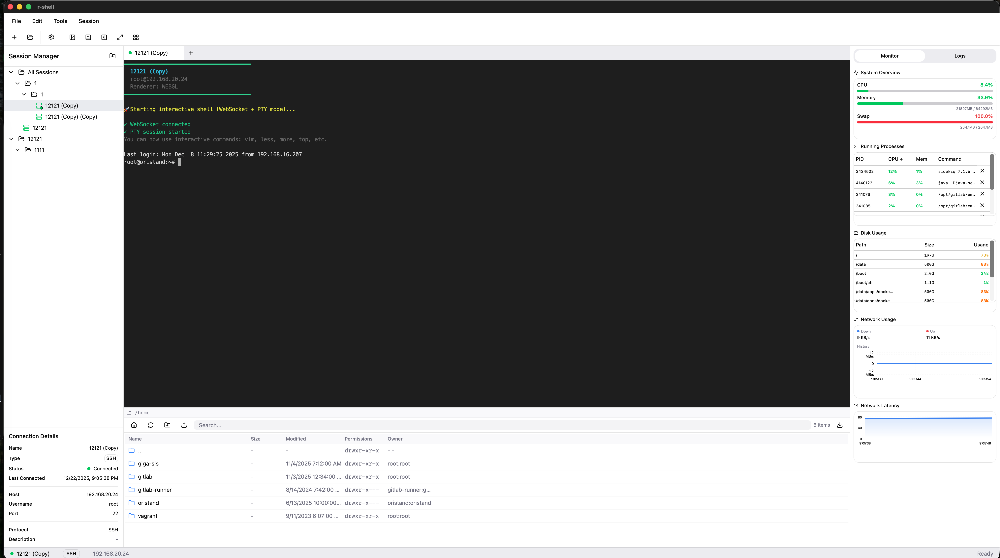

<div align="center">

# R-Shell — Modern SSH Client

[](https://github.com/GOODBOY008/r-shell/blob/main/LICENSE)
[](https://github.com/GOODBOY008/r-shell/actions/workflows/test.yml)
[](https://github.com/GOODBOY008/r-shell/actions/workflows/release.yml)
[](https://github.com/GOODBOY008/r-shell/stargazers)
[](https://github.com/GOODBOY008/r-shell/issues)
[](https://tauri.app/)
[](https://react.dev/)
[](https://www.rust-lang.org/)

A modern, feature-rich SSH/SFTP/FTP client built with React 19, TypeScript, and Tauri 2.

**Multi-protocol** · **Split terminals** · **SFTP file manager** · **GPU monitoring** · **Log viewer** · **Directory sync**

[Features](#-features) · [Install](#-installation) · [Screenshots](#-screenshots) · [Contributing](CONTRIBUTING.md) · [License](LICENSE)

</div>

---

## 📸 Screenshots

<div align="center">
  
  <p><i>R-Shell — split terminals, file manager, and system monitor in a single window</i></p>
</div>

---

## 🎯 About

R-Shell is a desktop SSH client that combines an interactive terminal, a dual-panel file manager, real-time system & GPU monitoring, and log viewing — all in one VS Code-like workspace. It is a **learning and practice project for vibe coding** methodology:

- 🎨 **AI-Generated Frontend** — The UI was generated from [Figma designs](https://www.figma.com/make/uUd7WO54vPnv03SmioKWqj/SSH-Client-Application)
- 🤖 **AI-Assisted Development** — The entire codebase is built with **GitHub Copilot**
- 🚀 **Native Performance** — Tauri 2 + Rust backend, not Electron

---

## ✨ Features

### 🔌 Multi-Protocol Connections
| Protocol | Authentication | Description |
|----------|---------------|-------------|
| **SSH** | Password, Public Key (with passphrase) | Full interactive PTY terminal |
| **SFTP** | Password, Public Key | Standalone file transfer sessions |
| **FTP** | Password, Anonymous | Plain FTP file transfers |
| **FTPS** | Password, Anonymous | FTP over TLS |

- **Connection Manager** — Tree-view sidebar with folders, favorites, tags, drag-and-drop organization
- **Connection Profiles** — Save, import/export (JSON), duplicate, edit saved connections
- **Session Restore** — Automatically reconnects your previous workspace on launch
- **Quick Connect** — Toolbar dropdown with recent connections
- **Auto Reconnect** — Exponential backoff reconnection (up to 5 attempts)

### 💻 Interactive PTY Terminal
- **Full terminal emulation** via xterm.js v5 — supports vim, htop, top, less, and all interactive programs
- **WebSocket streaming** — low-latency bidirectional I/O with flow control (inspired by ttyd)
- **WebGL renderer** — hardware-accelerated rendering with automatic canvas fallback
- **Terminal search** — regex and case-sensitive search with F3 navigation
- **Context menu** — copy, paste, select all, clear, save to file, reconnect
- **IME / CJK input** — full support for Chinese, Japanese, Korean input methods

### 🪟 Split Panes & Tab Groups
- **Split in 4 directions** — Up, Down, Left, Right
- **Recursive grid layout** — unlimited nested splits with resizable panels
- **Tab management** — add, close, duplicate, reorder (drag-and-drop), move between groups
- **Drop zone overlay** — drag tabs onto 5 drop zones (up/down/left/right/center)
- **Keyboard shortcuts** — Ctrl+\ split, Ctrl+1-9 focus group, Ctrl+Tab cycle tabs

### 📁 Dual-Panel File Manager (FileZilla-style)
- **Local + Remote panels** — side-by-side browsing with upload/download buttons
- **Works over SSH, SFTP, FTP, and FTPS** — unified file operations across all protocols
- **File operations** — create, rename, delete, copy files and directories
- **Breadcrumb navigation** — editable address bar with click-to-navigate
- **Sort & filter** — by name, size, date, permissions, owner (ascending/descending)
- **Multi-select** — select multiple files for batch operations
- **Transfer queue** — queued transfers with progress, speed, ETA, cancel, and retry
- **Recursive directory transfer** — uploads/downloads entire directory trees

### 🔄 Directory Synchronization
- **4-step sync wizard** — Configure → Compare → Review → Sync
- **Sync directions** — Local-to-Remote or Remote-to-Local
- **Comparison criteria** — Size, Modified time, or both
- **Diff preview** — per-item checkboxes with upload/download/delete/skip actions
- **Exclude patterns** — skip `.git`, `node_modules`, `.DS_Store`, etc.

### 📊 System Monitoring
- **CPU** — real-time usage percentage with color-coded thresholds
- **Memory & Swap** — total, used, free with percentage bars
- **Disk** — per-mount filesystem usage with progress bars
- **Uptime & Load Average** — at a glance
- **Process Manager** — list processes sorted by CPU/MEM, kill with confirmation
- **Real-time charts** — CPU history and memory area charts (Recharts)

### 🎮 GPU Monitoring
- **NVIDIA** (nvidia-smi) — utilization, memory, temperature, power, fan speed, encoder/decoder
- **AMD** — GPU stats support
- **Multi-GPU** — GPU selector with individual or "all" view
- **History charts** — utilization, memory, temperature over time
- **Temperature thresholds** — color-coded: green < 60°C, yellow < 75°C, orange < 85°C, red ≥ 85°C

### 🌐 Network Monitoring
- **Bandwidth** — per-interface rx/tx bytes per second
- **Latency** — real-time network latency measurements
- **Active connections** — protocol, local/remote address, state, PID
- **Usage charts** — download/upload history

### 📋 Log Monitoring
- **Multi-source** — log files, journalctl services, Docker containers, custom paths
- **Auto-discovery** — automatically finds available log sources on the remote host
- **Level filtering** — ERROR, WARN, INFO, DEBUG, TRACE filter chips
- **Regex search** — with match highlighting
- **Live tail** — configurable refresh interval (1s – 30s)
- **Line numbers + timestamps + level badges** — parsed from common log formats
- **Download** — save log content locally

### 🎨 Appearance & Customization
- **10 terminal color themes** — VS Code Dark, Monokai, Solarized Dark/Light, Dracula, One Dark, Nord, Gruvbox Dark, Tokyo Night, Matrix
- **Dark / Light / Auto** — application theme follows system preference
- **7 font families** — Menlo, JetBrains Mono, Fira Code, Source Code Pro, Consolas, Monaco, Courier New
- **Configurable** — font size, line height, letter spacing, cursor style (block/underline/bar), scrollback (1K–100K lines)
- **Background images** — custom image with opacity, blur, and position controls
- **Terminal transparency** — configurable opacity

### ⌨️ Keyboard Shortcuts
| Shortcut | Action |
|----------|--------|
| `Ctrl+B` | Toggle Connection Manager |
| `Ctrl+J` | Toggle File Browser |
| `Ctrl+M` | Toggle Monitor Panel |
| `Ctrl+Z` | Toggle Zen Mode |
| `Ctrl+\` | Split terminal right |
| `Ctrl+Shift+\` | Split terminal down |
| `Ctrl+1` – `9` | Focus terminal group |
| `Ctrl+W` | Close active tab |
| `Ctrl+Tab` | Next tab |
| `Cmd/Ctrl+F` | Search in terminal |
| `F3` / `Shift+F3` | Find next / previous |

### 🔧 Additional Features
- **VS Code-like layout** — resizable left/right sidebars + bottom panel with 5 layout presets (Default, Minimal, Focus, Full Stack, Zen)
- **Auto-update** — check for updates with download progress and install-and-relaunch
- **Menu bar** — File, Edit, Tools, Connection menus with full keyboard shortcuts
- **Status bar** — active connection name, protocol badge, connection status indicator
- **49 Tauri commands** — comprehensive Rust backend API

---

## 🛠 Tech Stack

### Frontend
- **React 19** + **TypeScript** — type-safe modern React
- **Tailwind CSS** — utility-first styling
- **Radix UI / shadcn/ui** — 48+ accessible component primitives
- **xterm.js v5** — terminal emulation with WebGL, search, web-links, fit, overlay addons
- **Recharts** — data visualization for monitoring
- **React Hook Form** — form handling
- **Lucide Icons** — icon set

### Backend
- **Tauri 2** — native desktop framework
- **Rust** — fast, memory-efficient backend
- **russh / russh-sftp** — SSH & SFTP protocol
- **suppaftp** — FTP/FTPS client
- **tokio** — async runtime
- **tokio-tungstenite** — WebSocket server for PTY streaming
- **sysinfo** — system stats collection

---

## 📦 Installation

### 🍺 Homebrew (macOS — Recommended)

```bash
brew tap GOODBOY008/tap
brew install --cask r-shell
```

**Update:**

```bash
brew upgrade --cask r-shell
```

### 📥 Download Releases

Download from the [Releases](https://github.com/GOODBOY008/r-shell/releases) page:

| Platform | File |
|----------|------|
| macOS (Apple Silicon) | `r-shell_x.x.x_aarch64.dmg` |
| macOS (Intel) | `r-shell_x.x.x_x64.dmg` |
| Windows | `r-shell_x.x.x_x64-setup.exe` |
| Linux | `r-shell_x.x.x_amd64.AppImage` / `.deb` |

---

## 🚀 Development

### Prerequisites

- Node.js ≥ 18
- pnpm
- Rust & Cargo

### Quick Start

```bash
git clone https://github.com/GOODBOY008/r-shell.git
cd r-shell
pnpm install

# Web only
pnpm dev

# Desktop with Tauri
pnpm tauri dev
```

### Build for Production

```bash
pnpm build && pnpm tauri build
```

### Testing

```bash
pnpm test          # Frontend (Vitest)
cd src-tauri && cargo test  # Rust
pnpm test:e2e      # E2E
```

### Version Bumping

```bash
pnpm run version:patch   # 1.0.0 → 1.0.1
pnpm run version:minor   # 1.0.0 → 1.1.0
pnpm run version:major   # 1.0.0 → 2.0.0
```

---

## 📁 Project Structure

```
r-shell/
├── src/
│   ├── components/           # React components
│   │   ├── ui/               # 48+ shadcn/ui primitives
│   │   ├── terminal/         # Split panes, tab groups, grid renderer
│   │   ├── pty-terminal.tsx   # PTY terminal (WebSocket + xterm.js)
│   │   ├── connection-*.tsx   # Connection dialog, manager, tabs
│   │   ├── file-*.tsx         # File browser, panels
│   │   ├── sftp-panel.tsx     # Dual-panel SFTP manager
│   │   ├── sync-dialog.tsx    # Directory synchronization
│   │   ├── transfer-*.tsx     # Transfer queue & controls
│   │   ├── system-monitor.tsx # CPU/MEM/Disk/GPU monitor
│   │   ├── network-monitor.tsx# Network stats
│   │   ├── log-monitor.tsx    # Multi-source log viewer
│   │   └── settings-modal.tsx # 6-tab settings
│   ├── lib/                   # State management & utilities
│   └── styles/                # Global CSS
├── src-tauri/                 # Tauri / Rust backend
│   └── src/
│       ├── ssh/               # SSH/SFTP implementation
│       ├── ftp_client.rs      # FTP/FTPS client
│       ├── commands.rs        # 49 Tauri commands
│       ├── websocket_server.rs# PTY WebSocket streaming
│       └── connection_manager.rs # Thread-safe session lifecycle
└── docs/                      # Documentation
```

---

## 🤝 Contributing

We welcome contributions! This project is an experiment in AI-assisted development.

**Quick Links:**
- [Contributing Guidelines](CONTRIBUTING.md)
- [Code of Conduct](CODE_OF_CONDUCT.md)
- [Version Bump Guide](docs/VERSION_BUMP.md)
- [Layout Guide](LAYOUT_GUIDE.md)
- [Quick Start](QUICKSTART.md)

### How to Contribute

1. Fork the repo
2. Create a feature branch (`git checkout -b feature/amazing-feature`)
3. Commit (`git commit -m 'feat: add amazing feature'`)
4. Push (`git push origin feature/amazing-feature`)
5. Open a Pull Request

### Areas We Need Help

- 🐛 Bug fixes and issue reports
- 📝 Documentation improvements
- ✨ Feature enhancements
- 🧪 Test coverage
- 🌐 Internationalization (i18n)
- 🎨 UI/UX improvements

---

## 📄 License

MIT — see [LICENSE](LICENSE).

## 🌟 Star History

[](https://star-history.com/#GOODBOY008/r-shell&Date)

## 💬 Community

- [Issues](https://github.com/GOODBOY008/r-shell/issues)
- [Discussions](https://github.com/GOODBOY008/r-shell/discussions)
- [Pull Requests](https://github.com/GOODBOY008/r-shell/pulls)

## 🙏 Acknowledgments

- [shadcn/ui](https://ui.shadcn.com/) — UI components
- [Figma Make](https://www.figma.com/make/) — Design generation
- [Lucide](https://lucide.dev/) — Icons
- [GitHub Copilot](https://github.com/features/copilot) — AI pair programming

---

<div align="center">

**Made with ❤️ and 🤖 AI**

If you like this project, please give it a ⭐!

</div>

