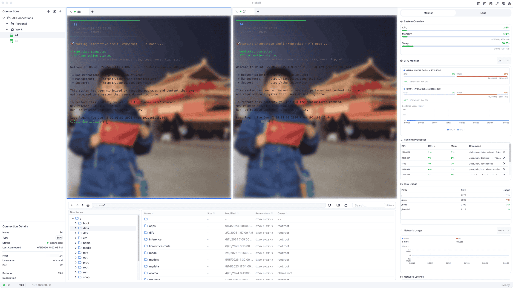

<div align="center">

# R-Shell — Lightweight SSH Client for macOS, Windows & Linux

[](https://github.com/GOODBOY008/r-shell/blob/main/LICENSE)
[](https://github.com/GOODBOY008/r-shell/actions/workflows/test.yml)
[](https://github.com/GOODBOY008/r-shell/actions/workflows/release.yml)
[](https://github.com/GOODBOY008/r-shell/stargazers)
[](https://tauri.app/)
[](https://react.dev/)
[](https://www.rust-lang.org/)

A modern SSH/SFTP/FTP/RDP/VNC client built with Rust and Tauri 2. **~98% less memory** than Java-based alternatives (~34 MB vs ~1.7 GB). Installer under 10 MB.

**Low memory** · **Native speed** · **Multi-protocol** · **Remote desktop** · **Split terminals** · **SFTP file manager** · **GPU monitoring** · **Log viewer** · **Directory sync**

[Features](#-features) · [Install](#-installation) · [Screenshots](#-screenshots) · [Development](#-development) · [Contributing](#-contributing)

</div>

---

## 📸 Screenshots

<div align="center">
  
  <p><i>R-Shell — split terminals, file manager, and system monitor in a single window</i></p>
</div>

---

## 🚀 Why R-Shell?

Most SSH clients (FinalShell, MobaXterm, Xshell) run on Java or Electron — burning memory even at idle. R-Shell uses Rust + Tauri 2 for native performance at a fraction of the cost.

### Memory Comparison

Measured on macOS (Apple Silicon, 16 GB RAM) using `footprint`:

| App | Technology | Memory | Relative |
|-----|-----------|--------|----------|
| **R-Shell** | Rust + Tauri 2 | **~34 MB** | **1×** |
| FinalShell | Java | **~1.7 GB** | **~50×** |

### Installer Size

| Platform | R-Shell | FinalShell | Savings |
|----------|---------|-----------|----------|
| **Windows** | **3.99 MB** | 64 MB | **16×** smaller |
| **macOS** | **8.13 MB** | 102 MB | **12×** smaller |

> No bundled JVM or Chromium — Tauri uses the OS native webview.

---

## 🎯 About

R-Shell combines an interactive terminal, dual-panel file manager, remote desktop viewer (RDP/VNC), real-time system/GPU monitoring, and log viewing in a single VS Code-like workspace. Built with Rust for native performance and minimal resource usage.

- **Native Performance** — Tauri 2 + Rust backend, not Electron or Java
- **AI-Generated Frontend** — UI generated from [Figma designs](https://www.figma.com/make/uUd7WO54vPnv03SmioKWqj/SSH-Client-Application)
- **AI-Assisted Development** — Entire codebase built with **GitHub Copilot**
- **Cross-Platform** — macOS, Windows, and Linux

---

## ✨ Features

### 🔌 Multi-Protocol Connections

| Protocol | Authentication | Description |
|----------|---------------|-------------|
| **SSH** | Password, Public Key | Full interactive PTY terminal |
| **SFTP** | Password, Public Key | Standalone file transfer sessions |
| **FTP** | Password, Anonymous | Plain FTP file transfers |
| **FTPS** | Password, Anonymous | FTP over TLS |
| **RDP** | Password | Remote Desktop Protocol |
| **VNC** | Password | Virtual Network Computing |

- **Connection Manager** — Tree-view sidebar with folders, favorites, tags, and drag-and-drop
- **Connection Profiles** — Save, import/export (JSON), duplicate, and edit connections
- **Session Restore** — Automatically reconnects your workspace on launch
- **Quick Connect** — Toolbar dropdown with recent connections
- **Auto Reconnect** — Exponential backoff reconnection (up to 5 attempts)

### 💻 Interactive PTY Terminal

- **Full terminal emulation** — xterm.js v5 with support for vim, htop, top, less, and all interactive programs
- **WebSocket streaming** — Low-latency bidirectional I/O with flow control
- **WebGL renderer** — Hardware-accelerated rendering with automatic canvas fallback
- **Terminal search** — Regex and case-sensitive search with F3 navigation
- **Context menu** — Copy, paste, select all, clear, save to file, reconnect
- **IME / CJK input** — Full support for Chinese, Japanese, Korean input methods

### 🪟 Split Panes & Tab Groups

- **Split in 4 directions** — Up, Down, Left, Right
- **Recursive grid layout** — Unlimited nested splits with resizable panels
- **Tab management** — Add, close, duplicate, reorder (drag-and-drop), move between groups
- **Drop zone overlay** — Drag tabs onto 5 drop zones (up/down/left/right/center)
- **Keyboard shortcuts** — `Ctrl+\` split, `Ctrl+1-9` focus group, `Ctrl+Tab` cycle tabs

### 📁 Dual-Panel File Manager (FileZilla-style)

- **Local + Remote panels** — Side-by-side browsing with upload/download buttons
- **Multi-protocol** — Works over SSH, SFTP, FTP, and FTPS
- **File operations** — Create, rename, delete, copy files and directories
- **Breadcrumb navigation** — Editable address bar with click-to-navigate
- **Sort & filter** — By name, size, date, permissions, owner (ascending/descending)
- **Multi-select** — Select multiple files for batch operations
- **Transfer queue** — Queued transfers with progress, speed, ETA, cancel, and retry
- **Recursive directory transfer** — Upload/download entire directory trees

### 🔄 Directory Synchronization

- **4-step sync wizard** — Configure → Compare → Review → Sync
- **Sync directions** — Local-to-Remote or Remote-to-Local
- **Comparison criteria** — Size, modified time, or both
- **Diff preview** — Per-item checkboxes with upload/download/delete/skip actions
- **Exclude patterns** — Skip `.git`, `node_modules`, `.DS_Store`, etc.

### 📊 System Monitoring

- **CPU** — Real-time usage with color-coded thresholds
- **Memory & Swap** — Total, used, free with percentage bars
- **Disk** — Per-mount filesystem usage with progress bars
- **Uptime & Load Average** — At a glance
- **Process Manager** — List processes sorted by CPU/MEM, kill with confirmation
- **Real-time charts** — CPU history and memory area charts (Recharts)

### 🎮 GPU Monitoring

- **NVIDIA** (nvidia-smi) — Utilization, memory, temperature, power, fan speed, encoder/decoder
- **AMD** — GPU stats support
- **Multi-GPU** — GPU selector with individual or "all" view
- **History charts** — Utilization, memory, temperature over time
- **Temperature thresholds** — Green < 60°C, yellow < 75°C, orange < 85°C, red ≥ 85°C

### 🌐 Network Monitoring

- **Bandwidth** — Per-interface rx/tx bytes per second
- **Latency** — Real-time network latency measurements
- **Active connections** — Protocol, local/remote address, state, PID
- **Usage charts** — Download/upload history

### 📋 Log Monitoring

- **Multi-source** — Log files, journalctl services, Docker containers, custom paths
- **Auto-discovery** — Finds available log sources on the remote host
- **Level filtering** — ERROR, WARN, INFO, DEBUG, TRACE filter chips
- **Regex search** — With match highlighting
- **Live tail** — Configurable refresh interval (1s – 30s)
- **Rich formatting** — Line numbers, timestamps, and level badges parsed from common log formats
- **Download** — Save log content locally

### 🎨 Appearance & Customization

- **10 terminal color themes** — VS Code Dark, Monokai, Solarized Dark/Light, Dracula, One Dark, Nord, Gruvbox Dark, Tokyo Night, Matrix
- **Dark / Light / Auto** — Application theme follows system preference
- **7 font families** — Menlo, JetBrains Mono, Fira Code, Source Code Pro, Consolas, Monaco, Courier New
- **Configurable** — Font size, line height, letter spacing, cursor style (block/underline/bar), scrollback (1K–100K lines)
- **Background images** — Custom image with opacity, blur, and position controls
- **Terminal transparency** — Configurable opacity

### ⌨️ Keyboard Shortcuts

| Shortcut | Action |
|----------|--------|
| `Ctrl+B` | Toggle Connection Manager |
| `Ctrl+J` | Toggle File Browser |
| `Ctrl+M` | Toggle Monitor Panel |
| `Ctrl+Z` | Toggle Zen Mode |
| `Ctrl+\` | Split terminal right |
| `Ctrl+Shift+\` | Split terminal down |
| `Ctrl+1` – `Ctrl+9` | Focus terminal group |
| `Ctrl+Shift+W` | Close active tab |
| `Ctrl+Tab` | Next tab |
| `Cmd/Ctrl+V` | Paste into terminal |
| `Cmd/Ctrl+F` | Search in terminal |
| `F3` / `Shift+F3` | Find next / previous |

> Layout shortcuts are ignored while the terminal input is focused, so terminal-native bindings (e.g. tmux `Ctrl+B`) still reach the shell.

### 🔧 Additional Features

- **VS Code-like layout** — Resizable left/right sidebars + bottom panel with 5 layout presets (Default, Minimal, Focus, Full Stack, Zen)
- **Remote Desktop** — Built-in RDP and VNC viewer with clipboard sync and dynamic resizing
- **Auto-update** — Check for updates with download progress and install-and-relaunch
- **Menu bar** — File, Edit, Tools, Connection menus with full keyboard shortcuts
- **Status bar** — Active connection name, protocol badge, connection status indicator

---

## 🛠 Tech Stack

### Backend
- **Tauri 2** — Native desktop framework using the OS webview (no bundled Chromium)
- **Rust** — Zero-cost abstractions, no GC, no JVM — ~34 MB vs ~1.7 GB
- **russh / russh-sftp** — Pure Rust SSH & SFTP implementation
- **suppaftp** — FTP/FTPS client
- **tokio** — Async runtime with minimal overhead
- **tokio-tungstenite** — WebSocket server for PTY streaming
- **sysinfo** — System stats collection

### Frontend
- **React 19** + **TypeScript** — Type-safe modern React
- **Tailwind CSS** — Utility-first styling
- **Radix UI / shadcn/ui** — 48+ accessible component primitives
- **xterm.js v5** — Terminal emulation with WebGL, search, web-links, fit, and overlay addons
- **Recharts** — Data visualization for monitoring
- **React Hook Form** — Form handling
- **Lucide Icons** — Icon set

---

## 📦 Installation

### 🍺 Homebrew (macOS — Recommended)

```bash
brew tap GOODBOY008/tap
brew install --cask r-shell
```

**Update:**

```bash
brew upgrade --cask r-shell
```

### 📥 Download Releases

Download from the [Releases](https://github.com/GOODBOY008/r-shell/releases) page:

| Platform | File |
|----------|------|
| macOS (Apple Silicon) | `r-shell_x.x.x_aarch64.dmg` |
| macOS (Intel) | `r-shell_x.x.x_x64.dmg` |
| Windows | `r-shell_x.x.x_x64-setup.exe` |
| Linux | `r-shell_x.x.x_amd64.AppImage` / `.deb` |

---

## 🚀 Development

### Prerequisites

- Node.js ≥ 18
- pnpm
- Rust & Cargo

### Quick Start

```bash
git clone https://github.com/GOODBOY008/r-shell.git
cd r-shell
pnpm install

# Web only
pnpm dev

# Desktop with Tauri
pnpm tauri dev
```

### Build for Production

```bash
pnpm build && pnpm tauri build
```

### Testing

```bash
pnpm test          # Frontend (Vitest)
cd src-tauri && cargo test  # Rust
pnpm test:e2e      # E2E
```

### Version Bumping

```bash
pnpm run version:patch   # 2.2.0 → 2.2.1
pnpm run version:minor   # 2.2.0 → 2.3.0
pnpm run version:major   # 2.2.0 → 3.0.0
```

---

## 📁 Project Structure

```
r-shell/
├── src/
│   ├── components/           # React components
│   │   ├── ui/               # 48+ shadcn/ui primitives
│   │   ├── terminal/         # Split panes, tab groups, grid renderer
│   │   ├── pty-terminal.tsx   # PTY terminal (WebSocket + xterm.js)
│   │   ├── connection-*.tsx   # Connection dialog, manager, tabs
│   │   ├── file-*.tsx         # File browser, panels
│   │   ├── sftp-panel.tsx     # Dual-panel SFTP manager
│   │   ├── sync-dialog.tsx    # Directory synchronization
│   │   ├── transfer-*.tsx     # Transfer queue & controls
│   │   ├── system-monitor.tsx # CPU/MEM/Disk/GPU monitor
│   │   ├── network-monitor.tsx # Network stats
│   │   ├── log-monitor.tsx    # Multi-source log viewer
│   │   └── settings-modal.tsx # 6-tab settings
│   ├── lib/                   # State management & utilities
│   └── styles/                # Global CSS
├── src-tauri/                 # Tauri / Rust backend
│   └── src/
│       ├── ssh/               # SSH/SFTP implementation
│       ├── ftp_client.rs      # FTP/FTPS client
│       ├── commands.rs        # 54 Tauri commands
│       ├── websocket_server.rs # PTY WebSocket streaming
│       └── connection_manager.rs # Thread-safe session lifecycle
└── scripts/                   # Version bump and build scripts
```

---

## 🤝 Contributing

We welcome contributions! This project is an experiment in AI-assisted development.

**Quick Links:**
- [Contributing Guidelines](CONTRIBUTING.md)
- [Code of Conduct](CODE_OF_CONDUCT.md)

### How to Contribute

1. Fork the repo
2. Create a feature branch (`git checkout -b feature/amazing-feature`)
3. Commit (`git commit -m 'feat: add amazing feature'`)
4. Push (`git push origin feature/amazing-feature`)
5. Open a Pull Request

### Areas We Need Help

- 🐛 Bug fixes and issue reports
- 📝 Documentation improvements
- ✨ Feature enhancements
- 🧪 Test coverage
- 🌐 Internationalization (i18n)
- 🎨 UI/UX improvements

---

## 📄 License

MIT — see [LICENSE](LICENSE).

## 🌟 Star History

[](https://star-history.com/#GOODBOY008/r-shell&Date)

## 💬 Community

- [Issues](https://github.com/GOODBOY008/r-shell/issues)
- [Discussions](https://github.com/GOODBOY008/r-shell/discussions)
- [Pull Requests](https://github.com/GOODBOY008/r-shell/pulls)

## 🙏 Acknowledgments

- [shadcn/ui](https://ui.shadcn.com/) — UI components
- [Figma Make](https://www.figma.com/make/) — Design generation
- [Lucide](https://lucide.dev/) — Icons
- [GitHub Copilot](https://github.com/features/copilot) — AI pair programming

---

<div align="center">

**Made with ❤️ and 🤖 AI**

If you like this project, please give it a ⭐!

</div>

