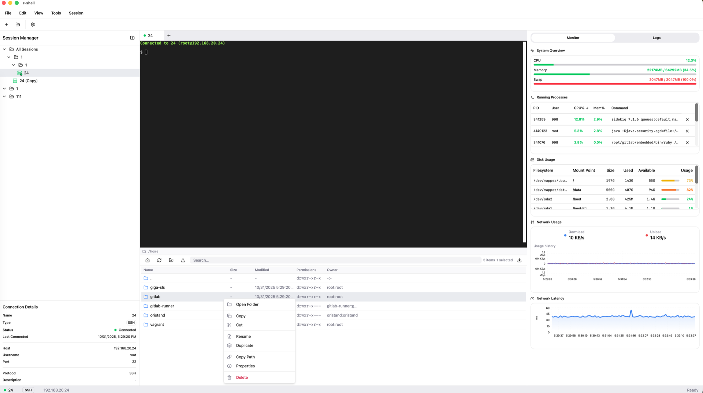

<div align="center">

# R-Shell - SSH Client Application

[](https://github.com/GOODBOY008/r-shell/blob/main/LICENSE)
[](https://github.com/GOODBOY008/r-shell/actions/workflows/test.yml)
[](https://github.com/GOODBOY008/r-shell/actions/workflows/release.yml)
[](https://github.com/GOODBOY008/r-shell/stargazers)
[](https://github.com/GOODBOY008/r-shell/issues)
[](https://github.com/GOODBOY008/r-shell/network)
[](https://tauri.app/)
[](https://react.dev/)
[](https://www.rust-lang.org/)

A modern, feature-rich SSH client application built with React, TypeScript, and Tauri.

[Features](#features) • [Installation](#getting-started) • [Documentation](#documentation) • [Contributing](CONTRIBUTING.md) • [License](LICENSE)

</div>

---

## 📸 Screenshots

<div align="center">
  
  <p><i>R-Shell's modern and intuitive interface</i></p>
</div>

---

## 🎯 Project Purpose

This project is a **learning and practice project for vibe coding** methodology. It demonstrates:

- 🎨 **AI-Generated Frontend**: The entire frontend UI is generated from Figma designs using [Figma Make](https://www.figma.com/make/uUd7WO54vPnv03SmioKWqj/SSH-Client-Application?node-id=0-1&t=ZzB8GvFKHeoUIZpw-1)
- 🤖 **AI-Assisted Development**: The complete development process is powered by **GitHub Copilot**
- 🚀 **Modern Workflow**: Experience the efficiency of AI-driven development with minimal manual coding

> **Note**: This is an experimental project to explore the capabilities and limitations of AI-assisted development workflows. The goal is to understand how far we can go with AI pair programming tools in building a complete desktop application.
>
> 📐 **View the Figma Design**: Check out the [Figma Make preview](https://www.figma.com/make/uUd7WO54vPnv03SmioKWqj/SSH-Client-Application?node-id=0-1&t=ZzB8GvFKHeoUIZpw-1) to see how the frontend was generated.

## Overview

R-Shell is a desktop SSH client that provides a beautiful and intuitive interface for managing SSH connections, file transfers, and remote system monitoring. Built with modern web technologies and packaged as a native desktop application using Tauri.

## Features

### 🔌 Connection Management
- **Multi-Session Support**: Manage multiple SSH connections simultaneously with an intuitive tabbed interface
- **Connection Profiles**: Save and organize your SSH connection profiles for quick access
- **Session Persistence**: Automatically save and restore your sessions across application restarts
- **Secure Authentication**: Support for password and SSH key-based authentication

### 💻 Terminal Experience
- **Full-Featured PTY Terminal**: Powered by xterm.js with complete terminal emulation
- **Customizable Themes**: Choose from multiple terminal color schemes and appearance settings
- **Keyboard Shortcuts**: Extensive keyboard shortcuts for improved productivity
- **Terminal Addons**: Advanced features including search, web links, and fit addon support

### 📁 File Management
- **Integrated SFTP Browser**: Browse, upload, and download files directly from the interface
- **Drag-and-Drop Support**: Easily transfer files between local and remote systems
- **File Operations**: Complete file management with rename, delete, move, and permission editing
- **Dual-Panel View**: Side-by-side local and remote file browsing

### 📊 System Monitoring
- **Real-Time Metrics**: Monitor CPU, memory, disk, and network usage in real-time
- **Resource Visualization**: Beautiful charts and graphs using Recharts
- **Network Monitor**: Track network traffic and connection statistics
- **Performance Logs**: View detailed system logs and application events

### 🎨 User Interface
- **Modern Design**: Clean and intuitive interface built with Radix UI primitives
- **Responsive Layout**: Resizable panels and flexible workspace arrangement
- **Dark/Light Themes**: Support for multiple UI themes
- **Accessibility**: Built with accessibility in mind using WAI-ARIA compliant components

### ⚡ Performance
- **Native Speed**: Powered by Tauri for true native performance
- **Low Memory Footprint**: Efficient resource usage compared to Electron-based alternatives
- **Fast Startup**: Quick application launch and connection establishment
- **Cross-Platform**: Works seamlessly on Windows, macOS, and Linux

## Tech Stack

### Frontend
- **React 19**: Modern React with latest features
- **TypeScript**: Type-safe development
- **Tailwind CSS**: Utility-first CSS framework
- **Radix UI**: Accessible component primitives
- **Lucide Icons**: Beautiful icon set
- **React Hook Form**: Form state management
- **Recharts**: Data visualization

### Backend/Desktop
- **Tauri 2**: Build native desktop apps with web technologies
- **Rust**: Fast and memory-efficient backend

## Project Structure

```
r-shell/
├── src/
│   ├── components/         # React components
│   │   ├── ui/            # Reusable UI components (Radix-based)
│   │   ├── pty-terminal.tsx        # PTY terminal with xterm.js
│   │   ├── integrated-file-browser.tsx  # SFTP file browser
│   │   ├── connection-manager.tsx   # Connection management
│   │   ├── system-monitor.tsx      # Real-time metrics
│   │   ├── connection-dialog.tsx   # SSH connection form
│   │   ├── session-tabs.tsx        # Tab navigation
│   │   ├── menu-bar.tsx            # Application menu
│   │   ├── settings-modal.tsx      # Settings dialog
│   │   └── ...                     # Other components
│   ├── lib/               # Utility functions
│   │   ├── session-storage.ts      # Persistent session profiles
│   │   ├── terminal-config.ts      # Terminal appearance settings
│   │   └── utils.ts                # Helper utilities
│   ├── styles/            # Global styles
│   ├── App.tsx            # Main application shell
│   ├── main.tsx           # React entry point
│   └── index.css          # Global CSS with Tailwind directives
├── src-tauri/             # Tauri/Rust backend
│   ├── src/
│   │   ├── ssh/           # SSH/SFTP implementation
│   │   ├── commands.rs    # Tauri command handlers
│   │   ├── websocket_server.rs  # WebSocket terminal I/O
│   │   ├── session_manager.rs   # Session lifecycle
│   │   ├── lib.rs         # Library setup
│   │   └── main.rs        # Application entry
│   ├── Cargo.toml         # Rust dependencies
│   └── tauri.conf.json    # Tauri configuration
├── docs/                  # Documentation
└── index.html             # HTML entry point
```

## Installation

### 🍺 Homebrew (macOS - Recommended)

The easiest way to install r-shell on macOS:

```bash
# Add the tap
brew tap GOODBOY008/tap

# Install r-shell
brew install --cask r-shell
```

**Update to the latest version:**

```bash
brew upgrade --cask r-shell
```

**Uninstall:**

```bash
# Remove the app
brew uninstall --cask r-shell

# Remove all app data
brew uninstall --zap --cask r-shell
```

### 📦 Download Releases

Download pre-built binaries from the [Releases](https://github.com/GOODBOY008/r-shell/releases) page:

- **macOS**: 
  - Apple Silicon: `r-shell_x.x.x_aarch64.dmg`
  - Intel: `r-shell_x.x.x_x64.dmg`
- **Windows**: `r-shell_x.x.x_x64-setup.exe`
- **Linux**: `r-shell_x.x.x_amd64.AppImage` or `.deb`

## Getting Started (Development)

### Prerequisites

- Node.js (v18 or higher)
- pnpm (recommended) or npm
- Rust and Cargo (for Tauri)

### Build from Source

1. Clone the repository:
```bash
git clone https://github.com/GOODBOY008/r-shell.git
cd r-shell
```

2. Install dependencies:
```bash
pnpm install
```

3. Run in development mode:
```bash
# Web only
pnpm run dev

# Desktop with Tauri
pnpm tauri dev
```

### Building for Production

```bash
# Build web assets
pnpm run build

# Build desktop application
pnpm tauri build
```

## Development

### Available Scripts

- `pnpm run dev` - Start Vite development server
- `pnpm run build` - Build for production
- `pnpm run preview` - Preview production build
- `pnpm tauri dev` - Run Tauri app in development mode
- `pnpm tauri build` - Build Tauri app for production

### Key Components

#### App.tsx
Main application component that manages:
- Session state and tabs
- Dialog modals (connection, SFTP, settings)
- Layout with resizable panels
- Session selection and navigation

#### Terminal Component
Provides terminal emulation with:
- Command input/output
- Session management
- Terminal themes
- Copy/paste support

#### Connection Manager
Tree-view interface for:
- Organizing connections into folders
- Quick connection access
- Edit, duplicate, and delete connections
- Connection status indicators (green dot for active)

#### File Browser
Integrated file management:
- Remote file browsing
- File upload/download
- Drag-and-drop support
- File operations (rename, delete, etc.)

#### System Monitor
Real-time monitoring:
- CPU usage
- Memory usage
- Network statistics
- Disk usage

## Contributing

Contributions are welcome! Please feel free to submit a Pull Request.

## Additional Resources

- [Tauri Documentation](https://tauri.app/)
- [Tauri API Reference](https://tauri.app/v2/api/js/)
- [React Documentation](https://react.dev/)
- [Vite Documentation](https://vitejs.dev/)
- [Rust Book](https://doc.rust-lang.org/book/)

## 🤝 Contributing

We welcome contributions from the community! This project is an experiment in AI-assisted development, and we're excited to see how the community can enhance it.

**Quick Links:**
- [Contributing Guidelines](CONTRIBUTING.md) - How to contribute
- [Code of Conduct](CODE_OF_CONDUCT.md) - Community guidelines
- [Version Bump Guide](docs/VERSION_BUMP.md) - How to bump versions
- [Layout Guide](LAYOUT_GUIDE.md) - Understanding the layout system
- [Quick Start](QUICKSTART.md) - Development setup

### How to Contribute

1. **Fork the repository**
2. **Create a feature branch** (`git checkout -b feature/amazing-feature`)
3. **Commit your changes** (`git commit -m 'feat: add amazing feature'`)
4. **Push to the branch** (`git push origin feature/amazing-feature`)
5. **Open a Pull Request**

Please read our [Contributing Guidelines](CONTRIBUTING.md) and [Code of Conduct](CODE_OF_CONDUCT.md) before contributing.

### Areas We Need Help

- 🐛 Bug fixes and issue reports
- 📝 Documentation improvements
- ✨ Feature enhancements
- 🧪 Test coverage
- 🌐 Internationalization (i18n)
- 🎨 UI/UX improvements

## 📄 License

This project is licensed under the MIT License - see the [LICENSE](LICENSE) file for details.

## 🌟 Star History

If you find this project useful, please consider giving it a star! ⭐

[](https://star-history.com/#GOODBOY008/r-shell&Date)

## 💬 Community & Support

- **Issues**: [GitHub Issues](https://github.com/GOODBOY008/r-shell/issues)
- **Discussions**: [GitHub Discussions](https://github.com/GOODBOY008/r-shell/discussions)
- **Pull Requests**: [GitHub PRs](https://github.com/GOODBOY008/r-shell/pulls)

## 🙏 Acknowledgments

- Built with components from [shadcn/ui](https://ui.shadcn.com/)
- UI design generated from [Figma Make](https://www.figma.com/make/)
- Icons from [Lucide](https://lucide.dev/)
- Powered by [GitHub Copilot](https://github.com/features/copilot)

---

<div align="center">

**Made with ❤️ and 🤖 AI**

If you like this project, please give it a ⭐!

</div>

